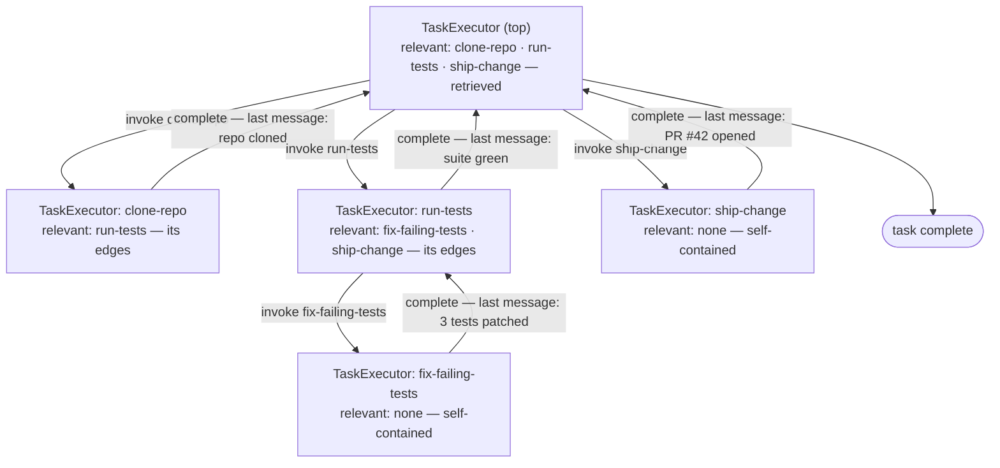

# ADR-0004: TaskManager & the recursive TaskExecutor

**Date:** 2026-09-13
**Status:** Proposed

## Context

Per [ADR-0003](./0003-retrieval-graph-execution-path.md), retrieval finds the relevant skills for a task instance. What remains is how execution consumes them: who owns the task, how a skill's sub-skills enter execution, and how a nested execution hands control back. Three facts drive this ADR:

1. **A task needs a single owner.** The TaskManager creates the task, checkpoints it, and tears it down (CoT discarded).
2. **Which skill to invoke is a runtime decision.** The LLM decides, one skill at a time — never precomputed (ADR-0003).
3. **A skill's edges already scope what can follow it.** The graph itself defines the next execution's relevant skills — no separate discovery step.

**Out of scope:** retrieval (ADR-0003); post-failure evolution (Distiller → Wiki → SkillProposer).

## Decision

### TaskManager — the single owner

1. **Create → retrieve → first TaskExecutor → teardown.** For an instance — a task by the user — a retrieval of relevant skills is done as per [ADR-0003](./0003-retrieval-graph-execution-path.md). The retrieved skills seed the first (top-most) TaskExecutor. The TaskManager drives it to the task outcome, checkpoints every state (crash-safe `llmx resume`), and tears down: persist the TaskRecord (goal, the chain of invoked skills, states, outcome, token usage — no CoT), discard the CoT.

### TaskExecutionState — relevant skills & tools

2. **The relevant skills & tools are part of the TaskExecutionState.** An executor sees only:
   - `relevant_skills` — where they come from depends on the executor (decisions 3 and 4);
   - `tools` — the tools bound to the current skill;
   - the task-level state — `goal` + `kv`: what `preState` / `postState` / edge conditions check, shared across every nested executor.

### Recursion

3. **First executor: retrieval.** The top-most TaskExecutor's relevant skills are the retrieved set (ADR-0003).
4. **Sub-task executor: edges.** When the parent TaskExecutor decides to invoke a skill, it creates a new TaskExecutor. For that sub-task executor, **the current task's defined edges become the relevant skills** — the condition-gated edge targets. A skill with no edges is **self-contained** — it needs no other skill; it just executes and produces the output that meets its `postState`. Its nested executor has no sub-skills to invoke, and completes by running the skill itself.
5. **Recursive by construction.** If the parent TaskExecutor decides to invoke another skill, another TaskExecutor is created — nesting to a bounded depth, each level scoped by its own relevant skills.
6. **The last-message handoff.** When a nested TaskExecutor completes — successfully or not — its **very last message is returned to the parent** and used in the parent's context for continuation of the task execution. That single message — plus the shared task state — is the only interface between levels.

**Guards:** nesting depth and the task budget are bounded. `preState` is **not a hard constraint** — the executor doesn't gate on it. Unlike a tool, a skill has no defined parameter structure to validate an invocation against, so the LLM is free to invoke any relevant skill. Invoked without its `preState` satisfied, the nested executor may simply fail — and that failure is just its output, the last message returned to the parent, which can re-trigger the skill once the proper `preState` is in place.

## Component sketch (Python)

Pydantic v2; field names mirror the decisions.

```python
class TaskExecutionState(BaseModel):
    goal: str                     # the task's goal — shared by every nested executor
    kv: dict                      # task-level state — preState / postState / edge conditions check these
    relevant_skills: list[Skill]  # retrieved set (first executor) · edge targets (nested)
    tools: list[ToolSpec]         # tools bound to the current skill
```

```python
class TaskManager:                # decision 1 — create → retrieve → first executor → teardown
    def execute(self, goal: str) -> TaskResult:
        task = self.create(goal)

        # an instance (a task by the user) — retrieval of relevant skills
        # is done as per ADR-0003; they seed the first TaskExecutor
        retrieved = self.retriever.retrieve(task.goal)
        state = TaskExecutionState(goal=task.goal, kv=task.kv,
                                   relevant_skills=retrieved,
                                   tools=self.tools_for(retrieved))

        last = TaskExecutor(state, self.gateway, self.budget).run()
        outcome = self.evaluator.check_task(task.goal, task.kv)
        return self.teardown(task, last, outcome)   # TaskRecord — no CoT


class TaskExecutor:               # decisions 4–6 — recursive, one per invoked skill
    def run(self) -> str:         # the very last message — returned to the parent
        messages = self.assemble(self.state)   # relevant skills · tools · state slice

        while not self.finished():             # goal met · nothing usable · stall · budget
            message = self.gateway.complete(messages, tools=self.state.tools)

            if message.invokes_skill:          # the LLM decides to invoke another skill
                skill = self.resolve(message.skill_id)   # any relevant skill — preState is advisory

                # a sub-task executor: the current task's defined edges become
                # its relevant skills — recursion
                sub = TaskExecutor(
                    state=TaskExecutionState(
                        goal=self.state.goal, kv=self.state.kv,
                        relevant_skills=subskills_of(skill, self.state.kv),
                        tools=skill.tools),
                    gateway=self.gateway, budget=self.budget)

                # when the nested executor completes — successfully or not —
                # its very last message is returned and used in the parent
                # context; a failure is just another output, and the parent
                # can re-trigger once the proper preState is in place
                messages.append(sub.run())
            else:
                messages.append(message)       # tool call / observation — continue

        return messages[-1]


def subskills_of(skill: Skill, kv: dict) -> list[Skill]:
    # the current task's defined edges become the relevant skills —
    # condition-gated; no edges → a self-contained skill: no sub-skills
    # to invoke, it just runs and produces its postState output
    return [load_skill(e.target) for e in skill.edges
            if e.condition_holds(kv)]
```

## Example

Goal: run the tests and ship the change. Retrieval (ADR-0003) finds `clone-repo`, `run-tests`, `ship-change` — the first TaskExecutor's relevant skills. `fix-failing-tests` was not retrieved; it arrives as an edge target.



1. The top executor invokes `clone-repo` → a nested executor whose relevant skills are `clone-repo`'s edge targets. It completes; its last message ("repo cloned") returns to the top executor's context.
2. The top executor invokes `run-tests` → a nested executor scoped by `run-tests`' edges: `fix-failing-tests`, `ship-change`.
3. Tests failing → that executor invokes `fix-failing-tests` → another nested executor (recursion). `fix-failing-tests` has no edges — it is self-contained; it just runs, and its last message ("3 tests patched") returns to the `run-tests` executor.
4. The `run-tests` executor continues — suite green — and completes; its last message returns to the top executor's context.
5. The top executor invokes `ship-change`; its last message ("PR #42 opened") returns; the task is complete. The chain of invoked skills is recorded in the TaskRecord.

## Consequences

**Positive**

- Every executor's context stays minimal — only its relevant skills (the retrieved set or the edge targets) and the current skill's tools
- The skill graph scopes execution for free — edges are the sub-task executor's relevant skills; no discovery, no library lookups during execution
- One well-defined interface between levels — the last message + the shared task state
- Re-running a step is a normal parent decision — just invoke the skill again
- A premature invocation is self-correcting — the nested failure returns as the last message, and the parent re-triggers once the `preState` is in place

**Negative / Risks**

- Every invocation creates a new executor — the context is rebuilt per level, bounded by the per-step token budget
- Between levels, only the last message and `kv` survive — richer intermediate detail is lost (by design)
- A skill outside the relevant set can never be used mid-execution — recorded as a `component_gap` (ADR-0003)
- Densely linked libraries nest deeply — bounded by the depth limit and the task budget

## References

- [ADR-0001](./0001-hybrid-retrieval-fusion.md) · [ADR-0002](./0002-skill-representation-filesystem-frontmatter.md) · [ADR-0003](./0003-retrieval-graph-execution-path.md) — retrieval; the first executor's relevant skills; `component_gap`
- HLD §3 · LLD §3, §5
