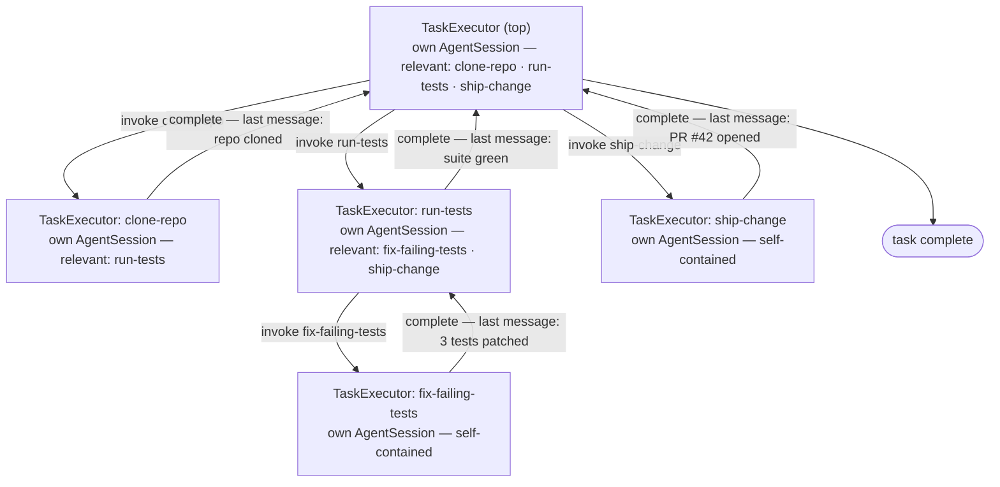

# ADR-0002: TaskManager & the recursive TaskExecutor

**Date:** 2026-09-13
**Status:** Proposed
**Revised:** 2026-09-25 — every executor drives a pi (`@earendil-works/pi-coding-agent`) `AgentSession`; the OpenAI-shaped `LlmRepository.complete()` gateway is gone.

## Context

Per [ADR-0001](../../future/0001-hybrid-retrieval-fusion.md), retrieval finds the relevant skills for a task instance. What remains is how execution consumes them: who owns the task, how a skill's sub-skills enter execution, and how a nested execution hands control back. Three facts drive this ADR:

1. **A task needs a single owner.** The TaskManager creates the task, checkpoints it, and tears it down (CoT discarded).
2. **Which skill to invoke is a runtime decision.** The LLM decides, one skill at a time — never precomputed (ADR-0001).
3. **A skill's edges already scope what can follow it.** The graph itself defines the next execution's relevant skills — no separate discovery step.

**Out of scope:** retrieval (ADR-0001); post-failure evolution (Distiller → Wiki → SkillProposer).

## Decision

### TaskManager — the single owner

1. **The Task owns its pre / post state.** A Task is `id` + `goal` + `pre_state` + `post_state` — the pre / post state are constructs of the Task itself, not a loose bag of values on the side: `pre_state` is what must hold when the task starts; `post_state` is what must hold when the task is done — the final verdict. The live facts they evaluate against are not on the Task — they live on the shared execution state as its `pre_state`.
2. **Create → retrieve → first TaskExecutor → teardown.** For an instance — a task by the user — a retrieval of relevant skills is done as per [ADR-0001](../../future/0001-hybrid-retrieval-fusion.md). The retrieved skills seed the first (top-most) TaskExecutor. The TaskManager drives it to the task outcome, checkpoints every state (crash-safe `llmx resume`), and tears down: persist the TaskRecord (goal, the **execution history** (decision 8), states, outcome, token usage — no CoT), discard the CoT.

### TaskExecutionState — relevant skills & tools

3. **The relevant skills & tools are part of the TaskExecutionState.** An executor sees only:
   - `skill` — the skill this executor runs (`None` for the top-most executor);
   - `relevant_skills` — where they come from depends on the executor (decisions 4 and 5);
   - `tools` — the tools bound to the current skill;
   - the task-level state — `goal` + `pre_state` / `post_state`, shared across every nested executor: `pre_state` is the **live facts** — what currently holds, updated as skills complete; `post_state` is **this execution's target** — the current skill's `postState`, the Task's at the top; edge conditions and the evaluator check against them;
   - `history` — the execution history (decision 8), append-only and shared the same way.

### Recursion

4. **First executor: retrieval.** The top-most TaskExecutor's relevant skills are the retrieved set (ADR-0001).
5. **Sub-task executor: a skill spins off an executor, not a tool result.** The parent's LLM invokes a skill as a **tool call** — but the library is procedural: the skill does not execute inline and become a tool result back in the parent's trajectory. The engine spins off a new TaskExecutor for it, whose **TaskExecutionState is defined by the skill** — the current skill's defined edges become the **relevant skills** (the condition-gated edge targets), the skill's `tools` become its tools. A skill with no edges is **self-contained** — it needs no other skill; it just executes and produces the output that meets its `postState`. Its nested executor has no sub-skills to invoke, and completes by running the skill itself.
6. **Recursive by construction.** If the parent TaskExecutor decides to invoke another skill, another TaskExecutor is created — nesting to a bounded depth, each level scoped by its own relevant skills.
7. **Pluggable context handoff — one pi AgentSession per executor.** Executors are independent — own state, own relevant skills — and what a nested executor starts with is **not hardwired**: blindly sharing the parent's history can hand a sub-task irrelevant or confusing context, and it compounds the deeper the system nests. A **context policy** decides — a pluggable class that takes the parent's transcript and returns what the child starts with. The executor doesn't know what to give the child — only the policy does, and it can be changed any way possible: share-all (one conversation), isolated (a clean slate), a filtered tail, a summary — anything. The policy is **configurable and passed by the parent** — declared per skill in the front matter (`contextPolicy`, [ADR-0002](./001-skill-representation-filesystem-frontmatter.md)), overridable at invocation. Every executor **runs its own fresh pi `AgentSession`** — in-memory, never the parent's session — seeded with `prev_messages` (what the policy let cross over — **not necessarily the parent's full history**) plus the **current skill — from the execution state — as part of the seed**: the executor needs the skill context — the skill's body, the procedure it runs ([ADR-0002](./001-skill-representation-filesystem-frontmatter.md)), the current state, and the current goal. The session is the executor's live transcript. When the nested executor completes — successfully or not — its **very last message is appended to the parent's transcript**, and the parent continues from it.
8. **Execution history.** The engine maintains an append-only **history of the entire task execution** — one engine-stamped record per skill invocation, across every nesting level: the skill, the invoking parent, whether its `postState` was met, and a one-line result summary (never reasoning). It is carried on the task-level state and persisted in the TaskRecord at teardown; the session transcripts themselves are still discarded (no CoT). What consumes the history is defined in the HLD — out of scope here.

**Guards:** an executor ends on any of — its skill's `postState` met · a final agent message (no tool call, no invocation) · the stall guard (consecutive turns, no `pre_state` change) · its budget share spent; nesting depth and the task budget are bounded. A not-met `postState` is not silence — the evaluator's failure reason goes back into the session as the next prompt: the LLM keeps working with direction, and if the executor ends anyway, the reason is the last message the parent sees. `preState` is **not a hard constraint** — the executor doesn't gate on it. Unlike a tool, a skill has no defined parameter structure to validate an invocation against, so the LLM is free to invoke any relevant skill. Invoked without its `preState` satisfied, the nested executor may simply fail — and that failure is just its output, the last message returned to the parent, which can re-trigger the skill once the proper `preState` is in place.

## Component sketch (TypeScript)

Plain TypeScript definitions; field names mirror the decisions. Every executor drives **its own pi `AgentSession`** (`@earendil-works/pi-coding-agent`) — one fresh in-memory session per executor, seeded by the context policy. Pi owns the model request, streaming, automatic retries, context overflow / compaction, and tool dispatch: bound tools are registered as pi custom tools, and **relevant skills are registered as tools too** — a skill invocation is intercepted (decision 5) and spins off the nested executor instead of running inline. One `AgentSessionRepository` per task is shared across every nesting level.

```ts
import {
  createAgentSession,
  SessionManager,
  type AgentSession,
  type ToolDefinition,
} from "@earendil-works/pi-coding-agent";

type Message = AgentMessage;         // pi transcript messages (user/assistant/toolResult)

interface StateCheck {               // the pre / post state construct — on the Task and the execution state
  required: Record<string, unknown>; // variables → values: predicates to satisfy · facts that hold
}

interface Task {                     // the instance — a task by the user
  id: string;
  goal: string;
  preState: StateCheck | null;       // what must hold when the task starts
  postState: StateCheck | null;      // what must hold when done — null: the Evaluator judges the goal
}

interface InvocationRecord {         // engine-stamped — one per skill invocation, every level
  skillId: string;
  invokedBy: string | null;          // the parent executor's skill — null at the top level
  postStateMet: boolean;
  resultSummary: string;             // one line — never reasoning
}

interface TaskExecutionState {
  goal: string;                      // the task's goal — shared by every nested executor
  preState: StateCheck;              // the live facts — what currently holds, updated as skills complete
  postState: StateCheck | null;      // this execution's target — the current skill's postState (the Task's, at the top)
  skill: Skill | null;               // the skill this executor runs — null at the top
  relevantSkills: Skill[];           // retrieved set (first executor) · edge targets (nested)
  tools: BoundTool[];                // tools bound to the current skill
  history: InvocationRecord[];       // append-only — the entire task's execution history
  session: AgentSession | null;      // pi — this executor's live transcript (decision 7: never shared wholesale)
}
```

```ts
interface AgentSessionRepository {   // the pi-coding-agent binding — one per task, shared across every nesting level

  // a fresh, in-memory AgentSession per executor (decision 7):
  // `seed` — what the policy/context assembler selected, replayed into the
  // session (SessionManager entries) *without* a model call — plus the
  // current skill's context; `tools` — bound tools + relevant skills
  // registered as pi custom tools
  start(seed: Message[], tools: ToolDefinition[]): Promise<AgentSession>;

  // pi runs the full turn sequence — model request, streaming, auto-retry,
  // tool dispatch. Resolves when the agent settles (no work left).
  prompt(session: AgentSession, text: string): Promise<void>;
}

class PiAgentSessionRepository implements AgentSessionRepository {
  async start(seed: Message[], tools: ToolDefinition[]): Promise<AgentSession> {
    const { session } = await createAgentSession({
      sessionManager: seedEntries(SessionManager.inMemory(), seed), // seeded — never the parent's session
      customTools: tools,
    });
    return session;
  }

  async prompt(session: AgentSession, text: string): Promise<void> {
    await session.prompt(text);      // pi owns the loop — the executor just prompts
  }
}

class TaskManager {                  // decisions 1–2 — the Task · create → retrieve → first executor → teardown
  private readonly repository = new PiAgentSessionRepository();  // ONE per task

  create(goal: string, initialState: Record<string, unknown> | null = null): Task {
    // preState ← what must hold at start (the initial state);
    // postState ← what defines success, when known upfront
    return {
      id: this.nextId(),
      goal,
      preState: { required: initialState ?? {} },
      postState: null,
    };
  }

  async execute(goal: string, initialState: Record<string, unknown> | null = null): Promise<TaskResult> {
    const task = this.create(goal, initialState);

    // an instance (a task by the user) — retrieval of relevant skills
    // is done as per ADR-0001; they seed the first TaskExecutor
    const retrieved = this.retriever.retrieve(task.goal);
    const state: TaskExecutionState = {
      goal: task.goal,
      preState: task.preState!,      // the facts that hold at start
      postState: task.postState,     // the Task's target — null: judged from the goal
      skill: null,
      relevantSkills: retrieved,
      tools: this.toolsFor(retrieved),
      history: [],
      session: null,                 // opened by the executor (decision 7)
    };

    await new TaskExecutor({
      repository: this.repository,   // the SAME repository across every nesting level
      state,
      prevMessages: [],              // nothing crosses into the top executor
      evaluator: this.evaluator, budget: this.budget,
    }).run();
    const outcome = this.evaluator.check(task.postState, state.preState);  // the final verdict — the Task's postState against the live facts
    return this.teardown(task, state, outcome);   // TaskRecord — the execution history, no CoT
  }
}

interface ContextPolicy {            // pluggable — decides what a child executor starts with
  select(parentSession: AgentSession): Message[];   // reads the parent's pi transcript
}

class ShareAll implements ContextPolicy {  // one conversation — the whole parent transcript
  select(parentSession: AgentSession): Message[] { return [...parentSession.messages]; }
}

class Isolated implements ContextPolicy {  // a clean slate — nothing crosses over
  select(_parentSession: AgentSession): Message[] { return []; }
}

class Tail implements ContextPolicy {      // e.g. only the last N messages cross over
  constructor(private readonly n: number) {}
  select(parentSession: AgentSession): Message[] { return parentSession.messages.slice(-this.n); }
}

class TaskExecutor {                 // decisions 5–8 — recursive, one pi AgentSession per executor
  constructor(
    private readonly opts: {
      repository: AgentSessionRepository;  // shared across every nesting level — sessions are per executor
      state: TaskExecutionState;
      prevMessages: Message[];             // what the parent's context policy let cross over — not necessarily the parent's full history
      evaluator: Evaluator;
      budget: Budget;
      parent?: TaskExecutor;               // the invoking executor — undefined at the top level
      depth?: number;                      // bounded — the nesting depth limit (guards)
    },
  ) {}

  private assemble(prevMessages: Message[], state: TaskExecutionState): Message[] {
    // the session's seed: a fresh array — prevMessages (what the context
    // policy let cross over — not necessarily the parent's full history) +
    // the current skill — from the state — as part of the seed (the executor
    // needs the skill context): its body — the procedure this executor runs —
    // the current state, the current goal, the relevant skills, the tool list
    throw new Error("not implemented");
  }

  private toolDefinitions(): ToolDefinition[] {
    // pi custom tools: the bound tools — dispatched by pi directly — plus
    // every relevant skill as a tool. A skill tool NEVER runs inline:
    // its execute() intercepts and spins off the child executor (decision 5),
    // returning the child's result summary as the tool result
    return [
      ...this.opts.state.tools.map(bindPiTool),
      ...this.opts.state.relevantSkills.map((skill) => defineTool({
        name: skill.id,                  // the skill is invocable — as a tool call
        description: skill.description,  // advisory — preState is not a hard constraint
        parameters: skillParams(skill),
        execute: async (args) => this.invokeSkill({ skill, args }),
      })),
    ];
  }

  async run(): Promise<TaskResult> {
    // one fresh pi AgentSession per executor — seeded, no model call
    this.opts.state.session = await this.opts.repository.start(
      this.assemble(this.opts.prevMessages, this.opts.state),
      this.toolDefinitions(),
    );
    return this.runLoop();
  }

  private async runLoop(): Promise<TaskResult> {
    const { repository, state, evaluator, budget } = this.opts;
    const session = state.session!;

    for (;;) {
      // pi runs the full turn sequence — the model requests tools,
      // pi dispatches them: regular tools execute in-session; skill
      // tools are intercepted → child executors (see invokeSkill)
      await repository.prompt(session, this.composePrompt(state));

      const last = session.messages.at(-1)!;   // the session IS the transcript

      // the evaluator says the state holds => this execution completed —
      // the very last message is what the parent continues from (guards)
      if (evaluator.check(state.postState, state.preState).met) {
        return { lastMessage: last, summary: summarize(last), success: true };
      }

      // not met — the failure reason goes back as the next prompt (guards):
      // the LLM keeps working with direction. The stall guard (consecutive
      // turns, no preState change) and the budget share end the loop
      // when no progress is made
      if (budget.expired() || stalled(state)) {
        return { lastMessage: last, summary: summarize(last), success: false };
      }
      this.queueFeedback(evaluator.reason());
    }
  }

  private async invokeSkill(opts: {
    skill: Skill; args: Record<string, unknown>;
  }): Promise<string> {
    const { state } = this.opts;

    // ------------------------------------------------------------
    // Procedural execution: instead of skill B becoming a tool result
    // back in this trajectory, spin off TaskExecutor-B — its own
    // TaskExecutionState AND its own fresh pi AgentSession — recursion.
    // What crosses over is the context policy's call, not the executor's.
    // ------------------------------------------------------------
    const sub = new TaskExecutor({
      repository: this.opts.repository,  // SAME repository — but a NEW AgentSession
      state: {
        goal: state.goal,
        preState: state.preState,         // carried forward — the live facts
        postState: opts.skill.postState,  // this sub-execution's target
        skill: opts.skill,
        relevantSkills: subskillsOf(opts.skill, state.preState),
        tools: opts.skill.tools, history: state.history,
        session: null,
      },
      prevMessages: opts.skill.contextPolicy.select(state.session!),  // what crosses over — the policy's call
      evaluator: this.opts.evaluator,
      budget: this.opts.budget.share(), parent: this, depth: (this.opts.depth ?? 0) + 1,
    });

    // ------------------------------------------------------------
    // The child executes independently. Only its FINAL result comes
    // back — the child's intermediate tool calls / skill calls never
    // enter the parent's trajectory.
    // ------------------------------------------------------------
    const result = await sub.run();

    // the very last message — the handoff into the parent context;
    // a failure is just another output, and the parent can
    // re-trigger once the proper preState is in place
    state.session?.pushMessage(result.lastMessage);
    return result.summary;
  }
}

function subskillsOf(skill: Skill, preState: StateCheck): Skill[] {
  // the current skill's defined edges become the relevant skills —
  // condition-gated against the live preState; no edges → a self-contained
  // skill: no sub-skills to invoke, it just runs and produces its postState output
  return skill.edges.filter((e) => e.conditionHolds(preState))
    .map((e) => loadSkill(e.target));
}
```

## Example

Goal: run the tests and ship the change. Retrieval (ADR-0001) finds `clone-repo`, `run-tests`, `ship-change` — the first TaskExecutor's relevant skills. `fix-failing-tests` was not retrieved; it arrives as an edge target.



1. The top executor invokes `clone-repo` — a tool call on its pi session; the engine spins off a nested executor with its own fresh AgentSession, its TaskExecutionState defined by the skill: relevant skills = its edge targets. It completes; its last message ("repo cloned") returns to the top executor's context.
2. The top executor invokes `run-tests` → a nested executor (own session) scoped by `run-tests`' edges: `fix-failing-tests`, `ship-change`.
3. Tests failing → that executor invokes `fix-failing-tests` → another nested executor (recursion). `fix-failing-tests` has no edges — it is self-contained; it just runs, and its last message ("3 tests patched") returns to the `run-tests` executor.
4. The `run-tests` executor continues — suite green — and completes; its last message returns to the top executor's context.
5. The top executor invokes `ship-change`; its last message ("PR #42 opened") returns; the task is complete. Every invocation across the levels — skill, parent, outcome — was stamped into the execution history, persisted in the TaskRecord.

Each invocation is a tool call on the executor's pi session that spins off an executor with its own fresh session — never a tool result in the parent's trajectory. What the child's session is seeded with is its context policy's choice (`shareAll` — the parent's whole transcript, `isolated` — nothing), followed by the skill itself as part of the seed: its procedure, the current state, the goal. When it completes, its very last message returns to the parent.

## Consequences

**Positive**

- Every executor's context stays minimal — only its relevant skills (the retrieved set or the edge targets) and the current skill's tools
- The skill graph scopes execution for free — edges are the sub-task executor's relevant skills; no discovery, no library lookups during execution
- The handoff between levels is well-defined — the child starts with whatever the policy selects, and the parent continues from the child's very last message
- Context hygiene at every level — a sub-task never inherits irrelevant or confusing history unless a policy explicitly says so; deep nesting stays clean
- The child's starting context is a policy decision, not an architecture decision — share-all, isolation, filtering, summarization are interchangeable, and the executor stays agnostic
- Invocation is LLM-native — a tool call — while execution stays procedural — a spun-off executor with its own state and its own session; no skill is ever flattened into a tool result
- Re-running a step is a normal parent decision — just invoke the skill again
- A premature invocation is self-correcting — the nested failure returns as the last message, and the parent re-triggers once the `preState` is in place
- The execution history captures every invocation with its outcome — engine-stamped, persisted in the TaskRecord, replayable without CoT
- The harness is not re-implemented — pi owns the model loop, streaming, retries, and compaction; the engine owns state, scoping, recursion, and history

**Negative / Risks**

- Every invocation creates a new executor — per-level state, scoping, and a fresh pi session are set up again (what crosses over is the policy's call, decision 7)
- A share-all policy grows the context with nesting and can confuse deep sub-tasks — the default policy should stay conservative, with per-skill / per-parent overrides as the escape hatch
- A skill outside the relevant set can never be used mid-execution — recorded as a `component_gap` (ADR-0001)
- Densely linked libraries nest deeply — bounded by the depth limit and the task budget
- Session behavior is pi-owned — retries, compaction, and tool semantics follow pi's defaults; deviations must go through pi's configuration, not local overrides

## References

- [Retrieval (future)](../../future/0001-hybrid-retrieval-fusion.md) — referred to as ADR-0001 above; the first executor's relevant skills; `component_gap`
- [ADR-0002](./001-skill-representation-filesystem-frontmatter.md) — skill front matter (`contextPolicy`); the skill body as procedure
- HLD §3 · §5 — where the execution history is consumed · LLD §3, §5
