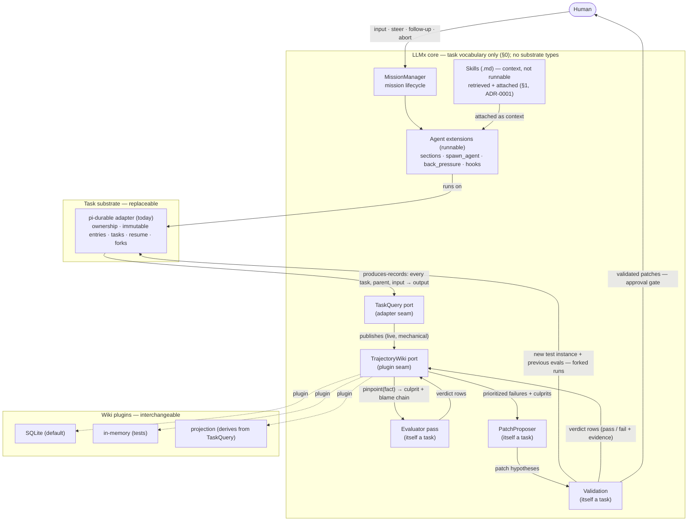
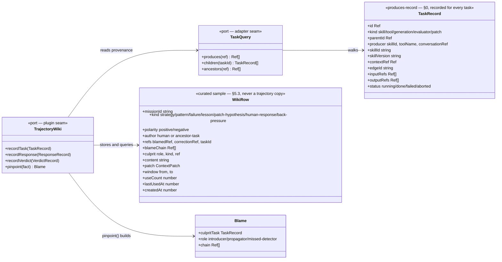
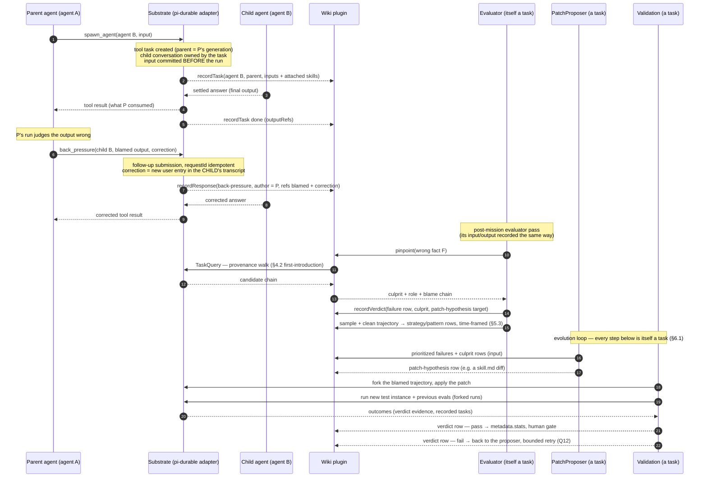

# ADR-0003: pi-durable's task graph as the execution substrate — trajectory, wiki, blame

**Date:** 2026-10-05
**Status:** Accepted (Q1–Q12) — amended with the agent/skill redefinition; Q13–Q16 open
**Amended:** 2026-10-05 — human responses are first-class wiki inputs (§5.1);
back-pressure as a recorded ancestor → descendant channel (§4.1);
culprit pinpointing over the entry DAG (§4.2);
everything-is-a-task + the produces record as the primitive (§0);
the wiki as a generalized pluggable extension, substrate decoupled (§5.2);
HLD/LLD diagrams added;
the wiki is a curated, time-framed sample with retention — never a trajectory copy (§5.3);
Patch Proposer + Validation close the evolution loop (§6.1);
skill usage + version recorded in the trajectory; wrong-context attribution (§3.1, §4.2);
agent = runnable, skill = additional context (never runnable) — §1, §2, §6

## Context

LLMx exists to (1) run a task as a nested skill execution, (2) record a **wiki of the
trajectory**, and (3) use that wiki to evolve **tools, skills, and contexts**. The
evolution loop is blame-driven: when a mission's final output is wrong, the system
must find **which intermediate output introduced the wrong information**, then
hypothesize a patch specific to the unit that produced it. That requires a durable
**parent → child** record of everything that ran and everything each consumer read.

Today that relation is hand-rolled three times, each partially:

- `MissionManager`/`DefaultTaskExecutorFactory`/`TaskExecutor` (ADR-0002) track
  depth and parentage in JS objects — lost at process exit, no crash recovery,
  no persistent history (execution history is decided but not persisted anywhere
  beyond the transcripts themselves).
- `spawn_agent` returns only the child's final text; where that text *came from*
  (which child conversation, which entries) is not recorded anywhere.
- `InMemoryWikiMaintainer` records free-text lessons keyed by a mutable
  `agentId` string — no reference into any transcript, no attribution, gone at
  process exit. It cannot answer "which output provided wrong information".

Meanwhile `@earendil-works/pi-durable` already provides the whole substrate:

| pi-durable primitive | What it gives LLMx |
|---|---|
| Every tool call is a `pi.tool` task **owned** by its generation task; every task names its owner (`TaskOwnership`) | parent → child edge, persisted, crash-safe |
| Subagent tool creates a child conversation with `ownership: {kind:'task'}`; `ConversationRecord.owner` links child conversation → parent conversation **permanently** (survives the owner task going terminal) | which conversation produced the text a parent consumed |
| `tx.scanConversations({ownerTaskId})` + `requestId` submissions | replay-safe spawn: a rerun after a crash finds the same child, never double-submits |
| `harness.resume()` | whole-mission crash recovery: pending tasks continue from last checkpoint |
| Abort runs bottom-up; parent is busy until owned work is idle | mission abort = subtree abort, for free |
| `taskGraph()` / `watchTaskGraph()` | the live execution tree for the UI, replacing hand-rolled event plumbing |
| Immutable entries (`pi.user`, `pi.assistant`, `pi.tool`, `pi.tool-result`) | the trajectory itself: every fact a consumer read is an entry that never changes |
| Custom entry kinds | verdicts / blame records committed atomically into the transcript |
| `defineDoc` committed state | pre/post execution facts per conversation |
| Forks (`fork(entryId)`) | replay a blame experiment from any historical point |
| Compaction keeps old entries in storage (the model just stops seeing them) | blame walks are unaffected by compaction |

The one thing pi-durable deliberately does **not** provide: cross-conversation,
cross-mission state. Documents are conversation-scoped; the registry/settings are
process-owned. The wiki is exactly that cross-mission state, so it must live
outside pi-durable — where is **Q1**.

## Decision

### 0. Everything is a task; the produces record is the primitive

Every unit of work — an agent run, a tool call, a model generation, an
evaluator pass, a patch hypothesis — is a **task**: it has a parent (owner),
consumes **input**, and produces **output**. That *produces* relation — what was
made, from what — is the primitive the whole wiki/blame model stands on, and it
is recorded for **every** task, no exceptions:

- The execution graph, the provenance DAG (§4.2), and the blame chain are the
  **same records read three ways** — one recording, three views.
- Coverage is total by construction: anything that affects the trajectory is a
  task. The one exception — the human input — is recorded as its own row kind
  with its author (§5.1).
- **The Evaluator and the PatchProposer are themselves tasks**: their inputs
  (queries) and outputs (verdicts, hypotheses) are recorded the same way, so
  the evolution loop is auditable by the very mechanism it audits.

The substrate materializes this for free: pi-durable already models everything
as a task and commits a task's input *before* it runs and its output entries
*after* — the adapter (§5.2) publishes those commits as produces-records. No
per-call-site instrumentation anywhere.

### 1. Agent = runnable; Skill = additional context, not runnable

The two concepts split by *runnability*:

- **Agent — runnable.** The unit that runs a task. An agent is **code**: an
  installed extension with its own sections (instructions / procedure), tools,
  and hooks. A mission runs agents; agents spawn agents (parent → child, §2).
- **Skill — additional context, never runnable.** A `.md` bundle (ADR-0001) of
  context — body, description, advisory facts — *retrieved and attached* to a
  running agent's prompt. A skill has no task, runs nothing, and produces
  nothing on its own; it informs the agent that runs.

ADR-0002's `agents/<domain>/<slug>/agent.md` + `composeSeed()` flattening is
deleted in both directions: agents stop being `.md` (they are code), and skills
stop being "run" (they are attached context). An agent's sections render its
own instructions **plus the skills bound to it**; the skill body is context,
never a procedure the agent must execute. `.md` skills remain the evolvable,
diffable, approval-gated text (ADR-0001).

> **Q7 (superseded):** the earlier "skills stay `.md`, executor is one shared
> extension" split is superseded by this redefinition — *agents* are code
> (runnable), *skills* are `.md` context (non-runnable). Q13 reopens the
> one-vs-many question in its place.

> **Q13 (open):** one generic runnable agent, or **one code extension per agent**
> (many agents, each its own tools/hooks)? Proposed: one extension per agent —
> matches "agent = runnable", keeps each agent's tools/hooks/sections explicit,
> and skills then vary *context across one agent* while separate agents vary
> *capability*.

> **Q16 (open):** how skills bind to an agent — (a) static declaration per agent
> (the agent lists its default skills), (b) runtime retrieval per task
> (ADR-0001 hybrid fusion), or (c) both (agent defaults + retrieval adds)?
> Proposed: (c) both.

### 2. An agent run = an owned child conversation; parentage is pi-durable's, not ours

`spawn_agent` (replaces `invoke_skill`) follows pi-durable's foreground-subagent
pattern (their example 22):

1. inside `api.commit()`, look up any existing child via
   `tx.scanConversations({ownerTaskId: api.taskId})` (idempotent replay);
2. create the child conversation with `ownership: {kind:'task', taskId: api.taskId}`,
   configured as the target **agent** (its extension, tools, model);
3. submit the child's task with `requestId` derived from the tool task id
   (crash-never-duplicates);
4. `api.details({conversationId: child})` records the link for UIs;
5. the child's settled answer becomes the tool result — a `pi.tool-result`
   entry **in the parent's transcript**, permanently pointing at the child
   conversation.

The hand-rolled depth counter, unknown-agent guards and history list in
`DefaultTaskExecutorFactory` are **deleted**; replaced by:

- depth bound → a `beforeTool` hook on `spawn_agent` reading a depth doc (or the
  tool simply not offered at the leaf, as today);
- execution history (ADR-0002 decision 8) → the **persisted task graph +
  ownership records**, which are strictly richer (they include tool calls,
  retries, compactions, costs).

Agent spawn allowlisting (which agent may spawn which) is orchestration policy on
the **agent** — code or a small manifest — since skills no longer structure
execution (§1). It gates `spawn_agent` targets via a `beforeTool` hook.

> **Q14 (open):** where do spawn edges (which agent may spawn which) live — on the
> agent definition (code/manifest, the enforced allowlist), or on skills as
> *contextual hints* ("you may consider agent X next", context only)?
> Proposed: allowlist on the agent (enforced); skills may add hints that are
> context, never the gate.

> **Q15 (open):** where do `preState`/`postState` live now — on the **agent** (the
> runnable task's own pre/post conditions), on the **skill** (advisory facts the
> context contributes), or both? Proposed: agent owns pre/post state (what the
> task must satisfy); skills contribute advisory facts that *inform* it.

> **Q6 (resolved):** delete `TaskExecutor`/`DefaultTaskExecutorFactory` outright, or keep
> a thin adapter so `MissionManager`/UI code keeps working during migration?

> **Q5 (resolved):** foreground children only (parent busy until child answers — matches
> today's synchronous spawn), or also adopt pi-durable's *background anchor*
> subagent pattern (persistent, steerable children that survive the parent's
> abort)? Background is more power than the current mission model needs — proposed:
> foreground only, revisit when a use case arrives.

### 3. The trajectory *is* the durable storage; nothing is recorded twice

One SQLite storage (WAL) holds every conversation, entry, task, and ownership
edge of every mission, forever. "Discard CoT between tasks" (README) is satisfied
the same way as today — each skill runs its own fresh conversation and the parent
sees only the tool result — but nothing is *deleted*: blame requires history.

This makes `InMemoryWikiMaintainer`'s separate recording of "what happened"
unnecessary; the wiki records only *distilled judgments*, each **referencing**
the trajectory (§5).

### 3.1 Skill usage is recorded in the trajectory — wrong context is attributable, not a guess

A skill is *context attached to* an agent task, so which skills were attached —
and what they injected — must be in the trajectory itself, not implied:

- Every produces-record carries its **active agent** (`agentId` + version) plus
  the **attached skills**: a list of `{ skillId, skillVersion, contextRef }` —
  `contextRef` = the entry holding the rendered skill context (*what the model
  was actually told*), `skillVersion` = git hash of `skill.md`.
- The conversation's `pi.agent` doc and its positional `pi.system` entries
  already commit exactly what was selected and rendered — the skill's context
  is an immutable entry, so "what the model was told" is inspectable at the
  exact point of use.
- **Version identity makes blame precise and evolution auditable:** blame can
  say "skill X v3 misled the agent here; v2 did not", and validation (§6.1)
  can fork and compare the same agent task across skill versions.

### 4. Blame = a walk over persisted ownership records; verdicts are entries

When the final output is wrong, attribution answers "which output provided wrong
information" by joining persisted records — no new bookkeeping:

```
final answer (pi.assistant, root conversation)
  → each fact it rests on traces to a pi.tool-result (the spawn_agent result)
      → its pi.tool task → owned child conversation (ConversationRecord.owner)
          → that conversation's entries (where the wrong fact was stated / decided)
              → recurse: which of the child's inputs (its own tool results) was wrong
```

The wiki's blame rows reference **entry ids** (immutable, so references can never
go stale). Attribution results are written back as a **custom entry kind**
`llmx.verdict` in the conversation where the verdict was reached, committed in the
same commit as the wiki row — the transcript is the audit log, the wiki the index.

> **Q2 (resolved):** is the verdict recorded in three places (wiki row + `llmx.verdict`
> entry + optionally the blamed entry's reference) too much? Proposed as stated;
> alternative is wiki-row-only (loses in-transcript audit) or entry-only (loses
> cross-mission query).

> **Q3 (resolved):** who produces verdicts/lessons — a **post-mission Evaluator agent**
> run over the whole persisted graph (batch, cheap, one place), **live hooks**
> (`afterTools`/`onYield` during the mission (immediate but needs judgement mid-run),
> or both (live verdicts for hard failures, post-mission distillation for lessons)?
> Proposed: post-mission Evaluator first — simplest, matches the HLD's Evaluator
> role; live hooks added only when latency of evolution matters.

### 4.1 Back-pressure: the ancestor pushes the judged failure back down the tree

Blame (§4) walks **up**: final answer → the introducing entry. Back-pressure is
the reverse flow: an ancestor agent that has judged a descendant's output wrong
feeds that failure back to the descendant. Two pi-durable facts fix its shape:

1. **A parent only judges after the child answers.** A generation waits for its
   tool calls before the next turn — so when the parent's model can judge a
   child's result wrong, that child conversation is **already idle**. Live
   `whenBusy: 'steer'` correction of a *running* child is reachable only by
   actors who sit outside that wait: the human (Q8) or a background-anchored
   child (Q5). Agent back-pressure is therefore **follow-up based**.
2. **The trajectory is immutable (§3).** Back-pressure never edits the blamed
   entry — corrections arrive as **new entries in the descendant's own
   conversation**, so blame references never rot and the wrong branch stays
   inspectable.

Two channels, both recorded:

- **In-run, agent-to-agent:** a `back_pressure` tool symmetric to
  `spawn_agent`. The parent names the blamed child conversation + entry,
  submits a follow-up ("your output E was wrong: reason — correct it") with a
  `requestId` (idempotent, crash-safe), waits, and the child's corrected answer
  is the tool result back in the parent's transcript. The child conversation
  *persists and reactivates* — it keeps its own context instead of being
  discarded for a fresh spawn. The correction is a `pi.user` entry in the
  **child's** trajectory; the wiki records a `back-pressure` row binding the
  pair (`refs`: blamed entry + correction entry, both conversation ids).
- **Post-verdict, evaluator-driven:** the evaluator's blame row points at
  entry E in descendant D; the ancestor's run is long over. Correction =
  **fork D from before E**, inject the verdict as the fork's opening input,
  re-run. Wrong branch and corrected branch both persist — blame reference
  intact, the correction replayable and comparable.

The **diffuse** form reaches the **Patch Proposer**, never the executor: the
distilled lesson informs proposed context patches (§5, §6) rather than rendering
into any run (ablation study planned — §5.2). The skill graph's `backwardDescription`
(ADR-0001 front matter) is this same concept at the procedure level — re-entering
a source skill gets the backward description in context; §4.1 generalizes it
from skills to conversations.

**Authorship must be recorded.** A steer, a follow-up, and agent back-pressure
are all `pi.user` entries — indistinguishable in the transcript. Every
`human-response` / `back-pressure` wiki row therefore records its **author**
(human via the root per Q8, or the ancestor conversation id). Blame walking a
child's trajectory must be able to tell a human turn from an ancestor's
pressure turn.

> **Q9 (resolved):** tool surface for in-run back-pressure — two tools
> (`spawn_agent` = fresh child, `back_pressure` = follow-up into the blamed,
> persisted child) as proposed, or one tool with a flag? Two is proposed:
> distinct intents, distinct audit trails, no confused model path.

### 4.2 Culprit pinpointing: role-discriminated attribution over the entry DAG

Wrong information flows through **multiple agents** — a deep descendant
introduces it, every ancestor above relays it — and back-pressure may travel
that same chain hop by hop. The wiki must therefore pinpoint the **culprit**
(the agent or tool that introduced the wrong fact), not the path. The entry
DAG makes the localization mechanical; only the role judgment needs an LLM:

**Fact provenance is data, not hypothesis.** Every entry's sources are known
from storage alone: a conversation's content comes from its user input (the
task its parent handed down) and its tool results — each `pi.tool-result`
sits under a `pi.tool` task whose owned conversation is recursively inspectable.
So for any wrong fact, the candidate chain from final consumer to earliest
source is a **walk over persisted records** — this is why §3 forbids deletion
and why tool calls persist *both* args (`pi.tool`) and output
(`pi.tool-result`) — pinpointing needs both.

**The culprit rule (first introduction).** For the wrong fact F:

1. Walk the provenance chain from the consumer that flagged F.
2. **Culprit = the earliest entry where F appears while absent from all of
   that entry's inputs.** Every earlier entry that contains F is a
   **propagator** — it relayed faithfully what it was fed.
3. **Tool descent:** if the first appearance of F is a `pi.tool-result`:
   - args were wrong → the **calling agent** is the culprit (it fed the tool
     garbage); patch target is the *skill*;
   - args were right, result wrong → the **tool** is the culprit; patch target
     kind `tool` (§6).
4. **Context descent:** if the first appearance of F is in a skill's rendered
   context (§3.1) — the system/section entry, not a model turn or tool result —
   then **the skill introduced wrong context**: the agent faithfully executed
   wrong instructions it was given. Culprit = the skill (`kind: 'skill'`): patch
   its content (the context it injects). If the context was correct and the
   agent still erred, the culprit is the agent's own turn (`kind: 'agent'`):
   patch the agent's instructions/tools/hooks. The two are separated by where F
   first appears, not by judgment.

The location (steps 1–2) is mechanical — a join over immutable records. The
finer role judgment — whether a propagator *should have caught* F with what
it knew (a **missed-detector**) — is the evaluator's LLM pass over the
localized candidates, never an open-ended search. Localization first,
judgment second; the wiki records both.

**Multi-hop back-pressure is recursive by symmetry.** An agent pressured
("your output E was wrong") that discovers F came from *its* child applies
`back_pressure` one level down — the pressure hops the chain, and **every hop
is a recorded `pi.user` entry with its author**, so the pressure path itself is
part of the trajectory. Post-verdict pressure needs no hops at all: the
evaluator has already pinpointed the culprit, so the §4.1 fork targets it
directly.

**Convergent pressure is a prioritization signal.** Multiple ancestors may
independently judge the same entry wrong; pressure rows bind to the blamed
entry, so the wiki can **count distinct ancestors that converged on one
culprit** — blame frequency ranks patch hypotheses (with skill
`metadata.stats` from §5).

> **Q10 (resolved):** allow level-skipping *in-run* back-pressure (a high ancestor
> directly submitting a follow-up into a deep descendant's conversation,
> skipping intermediate agents — mechanically trivial, ownership records are
> public)? Proposed: **no** — edge-by-edge only, so every pressured agent can
> add its local context and the audit chain stays complete at every hop;
> the evaluator's post-verdict fork is the pinpointed, hop-free path.

### 5. The wiki is a separate, cross-mission, **curated** store referencing the trajectory

The wiki (evolution memory) outlives conversations, so it is **not** a pi-durable
document — it is its own pluggable store (§5.2). But it is a **sample, never a
copy**: the full trajectory lives in the substrate, immutable and forever (§3);
the wiki stores only what the distiller judges worth keeping — sampled
**positive and negative strategies, recurring patterns, failures and lessons** —
each row a compact judgment plus refs into the substrate. Pinpointing (§4.2)
therefore always walks the **substrate** via TaskQuery: the wiki holds the
conclusions, never the evidence, and never the bulk. Rows are time-framed and
evicted by a retention policy (§5.3):

```ts
// all ids are opaque LLMx refs — the adapter maps them to substrate ids (§5.2)
interface WikiRow {
  id: string;
  missionId: string;
  kind: 'strategy' | 'pattern' | 'failure' | 'lesson' | 'patch-hypothesis' | 'human-response' | 'back-pressure';
  polarity?: 'positive' | 'negative'; // on strategy/failure rows — what the sample showed
  author: { kind: 'human' } | { kind: 'task'; taskId: Ref }; // §4.1 — human vs ancestor
  refs: {                        // references into the trajectory — immutable records
    blamedRef?: Ref;             // the blamed/found output
    correctionRef?: Ref;         // the response / back-pressure entry itself
    taskId?: Ref;                // e.g. the spawn_agent tool task
  };
  blameChain?: Ref[];            // ownership walk, materialized (§4.2)
  culprit?: {                    // pinpointed per §4.2 — on failure/lesson rows
    role: 'introducer' | 'propagator' | 'missed-detector';
    kind: 'tool' | 'skill' | 'agent';   // ContextKind — every improvable thing
    ref?: Ref;                   // culprit context id (tool / skill / agent)
  };
  content: string;               // the distilled judgment
  patch?: ContextPatch;          // { contextId, contextKind, patch, affected }
  // time framing + retention (§5.3) — rows are evicted; the trajectory never is
  window?: { from: number; to: number }; // trajectory span this row was sampled from
  useCount: number;                      // times rendered into a prompt
  lastUsedAt: number;                    // last render — recency input to retention
  createdAt: number;
}
```

### 5.1 Human responses are first-class wiki rows, recorded when they happen

The trajectory contains user messages alongside assistant ones, and the wiki
must record the human response too. In pi-durable every human input is a
`pi.user` entry — a submission, a **steer** (`whenBusy: 'steer'`, lands after the
current tool round and joins the running work), a follow-up, an abort — so the
human response is already part of the trajectory; the wiki only references it,
per §3's nothing-recorded-twice rule:

- a `human-response` row is written **mechanically, at submit time** (the
  submission path is LLMx code, so it can write the row in the same breath as
  the submit — no hook, no LLM, nothing async), `refs.correctionRef` = the
  `pi.user` entry, `author` = human;
- a human correction mid-run is the **strongest blame signal the system
  receives**: it directly asserts "this conversation's current direction is
  wrong" — no evaluator pass needed to know that a judgment occurred, only to
  know *what it means*;
- what the response *meant* (which earlier output was wrong, what the lesson
  is) is still distilled by the evaluator pass (Q3), which reads these rows
  alongside the trajectory and upgrades them to `failure`/`lesson` rows with
  blame chains where warranted; the raw `human-response` row is kept either way.

This makes the mission **interactive by construction**: pi-durable's inbox
model (steer / follow-up / reject, abort) *is* the human-in-the-loop mechanism,
and the mission's root conversation becomes a standing conversation the user
talks to — not a one-shot prompt as in today's `MissionManager.run()`.

> **Q8 (resolved):** confirm the interactive mission model: the user can steer any
> running conversation mid-run (root, or spawned children too?), and follow-ups
> keep a conversation alive after it answers. Proposed: steering is offered at
> the root conversation only; children are driven by their parent agents.
> Anything a human steers into a child arrives as the root steer's consequence
> (abort, follow-up), never as a direct human→child channel.

Skill `metadata.stats` (runs, success rate — ADR-0001) is updated from the same
evaluator pass, driving patch prioritization.

Lessons never flow back into the executor. The wiki feeds only the **Patch
Proposer** (prioritized failures + culprits), which proposes context patches
(§6). Evolution reaches execution solely through patched contexts — tools,
skills, `agent.md` — never by rendering wiki rows into a run.

> **Ablation study (planned):** whether the wiki should *also* plug lessons into
> the executor is deferred to an ablation experiment; the current architecture
> wires the wiki to the Patch Proposer only.

> **Q1 (resolved):** which **wiki plugin** ships as the default
> (§5.2): (a) SQLite (simple id joins; proposed), (b) plain files/`.md` like
> skills (diffable, but unqueryable for ref joins at scale), (c) projection
> (derives rows from a TaskQuery on demand — always consistent, but recompute
> cost on every query). The others remain installable plugins regardless. Which?

### 5.2 The wiki is a generalized pluggable extension — LLMx core never touches the substrate

The wiki is not a module that calls into pi-durable; it is a **pluggable
extension** behind two ports:

- **TaskQuery port (adapter seam)** — provenance reads over the
  produces-records: `produces(ref)`, `children(taskId)`, `ancestors(ref)`.
  Implemented today by the pi-durable adapter walking its ownership/entry
  records; swappable with any substrate that records input → output per task.
- **TrajectoryWiki port (plugin seam)** — recording and queries:
  `recordTask`, `recordResponse`, `recordVerdict`, `pinpoint(fact)`,
  `prioritizedFailures()`. Plugins are interchangeable: **SQLite** (default),
  **in-memory** (tests), **projection** (derives rows from a TaskQuery on
  demand — always consistent with the trajectory, recomputes blame chains).

Two rules keep the substrate at arm's length:

1. **Ingestion is mechanical and live; storage is curated.** The plugin
   *receives* every task's produces-record as it happens — the adapter
   publishes from storage commits (input committed before the run, output
   after) — no hooks at call sites, no LLM. What it *stores* is the curated
   subset (§5.3): small pointer rows (human responses, back-pressure) on
   occurrence; strategy / pattern / failure rows only after the distiller's
   judgment (Q3).
2. **No substrate types cross the boundary.** Every id in the wiki schema is
   an **opaque LLMx ref** (see the schema above); the adapter maps refs to
   substrate ids. The core speaks only the task vocabulary of §0 — "no need
   to explicitly work with pi-durable" is enforced structurally: replace the
   adapter and the wiki, the blame model, and the evolution loop are untouched.

### 5.3 Curation and retention: the wiki stays small, the trajectory stays forever

The wiki's purpose is context, not archive:

- **Sampling, not copying.** The distiller (the evaluator pass, Q3) samples the
  trajectory — positive runs and negative runs — cleans it, and stores only
  the relevant: strategies that worked, strategies that failed, patterns that
  recur. The full trajectory stays in the substrate, immutable and unbounded
  (§3); wiki rows are compact judgments with refs into it.
- **Rows are time-framed.** A row records the trajectory window it was sampled
  from (`window: {from, to}`), so staleness is measurable: a strategy distilled
  from an old generation of skills is *dated*, not merely old.
- **Retention is a cache policy.** The plugin evicts rows that are old **and**
  infrequently used (`lastUsedAt` + `useCount`), so the store cannot grow
  unbounded. Reads are bounded too: `prioritizedFailures()` returns top-k by
  recency × frequency × blame convergence (§4.2) — the Patch Proposer's input
  stays small; nothing renders into the executor.
- **Eviction never deletes evidence.** A wiki row is a judgment with refs; evict
  it and the substrate trajectory — and its pinpointability — is untouched. A
  gated/approved patch hypothesis has already left the wiki: it lives as a
  skill diff in git (§6). And a distilled-then-evicted judgment is re-derivable
  by re-running the distiller over the still-stored trajectory.

### 6. Patch targets: any task's producer; application is validated, then gated

A patch targets whatever produced the culprit task (§4.2) — the culprit's kind
decides the target, and any task kind is patchable:

| Culprit task kind | Patch target | Gate |
|---|---|---|
| agent (instructions / tools / hooks wrong; context was correct) | agent extension code | validation (§6.1) + human review (code) |
| skill (context misleading — §4.2 context descent) | `skill.md` diff | validation (§6.1) + approval gate (ADR-0001) |
| tool (wrong result, right args) | tool / extension code (PR) | validation (§6.1) + human review (code) |
Two sources of wrong context are distinct: a skill's injected content misleading
an agent is a *skill* patch (validated + gated, §6.1); a wrong tool description is
a *tool* patch (validated + gated). Lessons are not a patch target — they never
reach the executor (§5.2). §4.2's context descent separates the cases by where
the wrong fact first appears.

> **Q4 (resolved):** every patch is validated (§6.1) then human-gated; nothing is
> auto-applied and no lesson is auto-injected — the wiki feeds only the Patch
> Proposer (§5.2).

### 6.1 Patch Proposer and Validation: the evolution loop, all of it tasks

Two more components — both themselves tasks (§0), so their inputs and outputs
are recorded like everyone else's, and the evolution loop audits itself:

- **Patch Proposer (a task).** Input: prioritized failures and culprit rows
  from the wiki, plus their referenced trajectories read through TaskQuery.
  Output: `patch-hypothesis` rows — a proposed patch for **any task kind's
  producer** (skill, tool, agent, context — §6), never an applied change.
- **Validation (a task).** A hypothesis is validated **before** the human gate
  (Q4), on two fronts:
  1. **A new test instance** — the same task run fresh with the patch applied,
     on a forked trajectory: never a live mission (§3's immutability keeps
     the original intact and the two runs comparable).
  2. **Previous available evals** — the accumulated instances of that
     particular task: the blamed instance reproduced, prior stored instances
     of the same skill (regression — found via TaskQuery, plus the skill's
     declared `testSuite`, ADR-0001), and cases from earlier verdicts.

  Both fronts are themselves task instances — recorded, sampled by the
  distiller, and reusable: **validation grows the eval set it is checked
  against**.
- **Outcome.** A verdict row (pass / fail + evidence refs into the validation
  tasks) binds to the hypothesis row; skill `metadata.stats` updates from it;
  a passed patch surfaces at the human gate; a failed patch's verdict returns
  to the proposer as input — a bounded propose → validate → retry loop.

> **Q12 (resolved):** (a) gate order and retry bound — validation-before-gate with
> bounded auto-retries (verdict fed back to the proposer), as proposed, or
> human-gate-first with validation after approval? (b) who runs the validation
> tasks — the evaluator machinery, a dedicated validator per task kind, or the
> skill's `testSuite` runner (ADR-0001)?

### 7. Non-decisions (explicitly out of scope)

- Retrieval (ADR-0001 hybrid fusion) — unchanged.
- Multi-mission concurrency, remote UIs — the harness is single-process; storage
  is owned by one process (pi-durable constraint).
- Migration order — separate plan once this ADR is accepted.

## Design diagrams (HLD / LLD)

**HLD — components and the two pluggable seams** (the wiki plugin, the substrate
adapter; the core speaks only §0's task vocabulary):



**LLD — the data model** (the produces-record, the wiki row, the two ports;
all ids are opaque refs):



**LLD — runtime**: one agent run whose output is judged wrong — the
produces-records, the back-pressure hop, and the evaluator's pinpoint:



## Consequences

**Positive**

- Parent → child, crash-safe resume, subtree abort, replay-safe spawn, idempotent
  submits, live task graph for the UI: all inherited; the hand-rolled depth /
  history / parentage bookkeeping is deleted.
- Blame becomes a graph join over **immutable** records; references cannot rot.
- One source of truth for the trajectory; the wiki holds only judgments.
- Forks let a blamed subtree be re-run from any historical entry for experiments —
  and validation reuses the same mechanism: patches are tested on forks, never
  on live missions.
- The wiki stays bounded by design: sampling + retention keep the Patch
  Proposer's inputs small, while the substrate keeps everything — context
  hygiene without evidence loss (nothing renders into the executor).
- Two pluggable seams (wiki plugin, substrate adapter) contain pi-durable's
  experimental API churn: the task vocabulary (§0), the blame model, and the
  evolution loop all survive a substrate swap.

**Negative / Risks**

- pi-durable is **experimental** ("API changes without notice") — the substrate
  pins LLMx to an unstable dependency; mitigate by confining all pi-durable types
  to `src/durable/` (already the layout).
- Blame fidelity depends on the Evaluator's judgement, not the recording — the
  substrate records *provenance*, deciding *wrongness* is still an LLM pass.
- Wiki joins cross two stores; referential integrity is app-level (durable
  storage never deletes, so risk is low).
- `typebox` runtime weight (~23 MB peak RSS unbundled) — noted upstream.
- Eviction is lossy by design: a distilled-then-evicted judgment costs a
  re-distillation pass to recover (the trajectory it came from is never gone,
  §3) — the trade is context size vs. recompute, deliberately taken.
- Retention thresholds (TTL, use-count, top-k budget) are plugin config, not
  ADR law — Q11.

## Decision record (Q1–Q12 accepted; Q13–Q16 open)

Q1–Q12 were resolved as **Accepted** on 2026-10-05; each question's inline
marker above records the option in force. Q13–Q16 arise from the agent/skill
redefinition (§1) and are proposed below with defaults.

| # | Question | Decision |
|---|---|---|
| Q1 | Default wiki plugin (§5.2): SQLite, files, or projection | SQLite |
| Q2 | Verdict recorded as entry + wiki row (proposed), wiki-row only, or entry only | entry + wiki row |
| Q3 | Judgment producer — verdicts, pinpointing, and §5.3's strategy/pattern sampling + cleaning: post-mission Evaluator, live hooks, or both | post-mission Evaluator |
| Q4 | All patches validated then human-gated; wiki feeds only the Patch Proposer (no auto lesson injection) | yes |
| Q5 | Subagents: foreground only, or also background-anchored persistent ones | foreground only |
| Q6 | Delete TaskExecutor/factory outright or keep a thin adapter for migration | delete (fresh migration, no external users) |
| Q7 | *(superseded by §1)* skills `.md` / executor-shared-extension split | superseded; see Q13 |
| Q8 | Interactive missions: steer at root only (proposed) or also directly into spawned children | root only |
| Q9 | In-run back-pressure surface: two tools (`spawn_agent` + `back_pressure`) vs one flagged tool | two tools |
| Q10 | Level-skipping in-run back-pressure (high ancestor → deep descendant directly) vs edge-by-edge hops only | edge-by-edge only |
| Q11 | *(non-blocking, plugin config)* Retention: evict when old AND unused (`window` age + `useCount`), render top-k by recency × frequency × convergence | as described |
| Q12 | Validation gate order + retry bound; who runs validation tasks (evaluator machinery / per-kind validator / skill `testSuite` runner) | validate-before-gate, bounded retries, evaluator machinery |
| Q13 | One generic runnable agent vs one code extension per agent | proposed: one extension per agent |
| Q14 | Spawn edges live on the agent (enforced allowlist) vs skills (context hints) | proposed: agent |
| Q15 | `preState`/`postState`: agent-owned task conditions vs skill advisory facts vs both | proposed: agent owns; skills advisory |
| Q16 | Skill binding: static per-agent vs runtime retrieval (ADR-0001) vs both | proposed: both |

## References

- [ADR-0001](./001-skill-representation-filesystem-frontmatter.md) — skill representation
- [ADR-0002](./002-taskmanager-recursive-execution.md) — recursive TaskExecutor (superseded in part by this ADR)
- pi-durable README + `docs/spec.md` (normative spec) — `@earendil-works/pi-durable@1.0.0`
- `plan.md` — per-conversation injected spawn tool (already landed; §2 builds on it)

• Monitors execution logs, metrics, or test failures to spot when an agent or pipeline breaks.
• Diagnosis – Reads error traces or system exceptions to find the exact root cause of the failure.
• Repair – Executes corrective actions like writing a code patch, updating a config file, or requesting more memory.
• Validation – Runs automated test suites or CI/CD pipelines to confirm if the fix solved the problem.
• Learning Store – Saves past reasoning updates and lessons to a persistent file so the agent avoids repeating the same error on future runs.