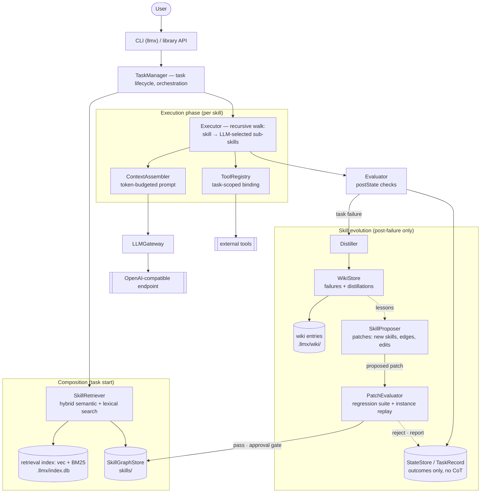
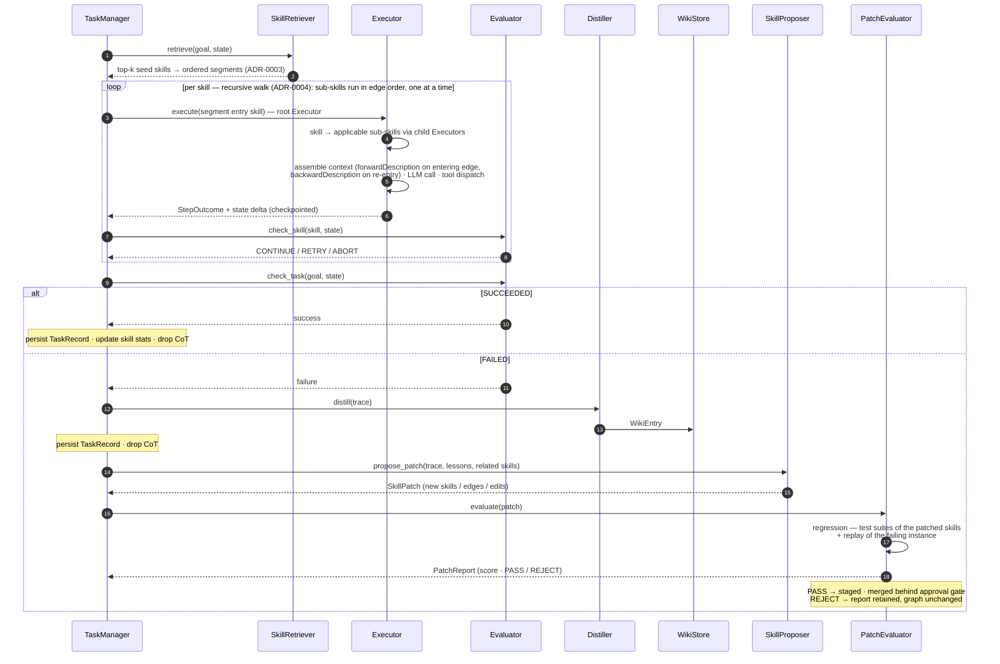

# LLMx — High-Level Design (HLD)

**Status:** Draft v1.0
**Confirmed decisions:** Python · CLI + library core · Filesystem skills + derived retrieval index · OpenAI-compatible LLM gateway · Wiki stores failures + distillations · Weighted hybrid retrieval — [ADR-0001](../adr/0001-hybrid-retrieval-fusion.md) · Skills as filesystem Markdown + YAML front matter — [ADR-0002](../adr/0002-skill-representation-filesystem-frontmatter.md) · Skill graph via seed + full leaf traversal & segment-based execution path — [ADR-0003](../adr/0003-retrieval-graph-execution-path.md) · TaskManager-defined path & recursive Executor — [ADR-0004](../adr/0004-taskmanager-recursive-execution.md) · TaskState envelope, condition-terminated loops & runtime sub-skill selection — [ADR-0005](../adr/0005-taskstate-envelope-loops-selection.md)

---

## 1. Overview

### 1.1 Problem

LLM agent contexts grow unboundedly and get poisoned by irrelevant skills, tools, and stale reasoning. Loading every skill/tool into every session degrades performance, and current skill systems are descriptive rather than procedural — there is no way to execute a skill as a defined sequence of state transitions.

### 1.2 Goals

- **Task-scoped context:** each task instance receives only the skills and tools relevant to it.
- **Procedural skills:** skills form a state-transition graph (`preState` → `postState`); executing a task is traversing a path through this graph.
- **Context hygiene:** Chain-of-thought (CoT) lives inside a single task instance and is discarded afterward. Only distilled state, outcomes, and failure lessons persist between tasks.
- **Skill evolution:** failures are distilled into an experience wiki; the SkillProposer turns them into skill patches (new skills, edges, edits) so the library improves for future tasks.

### 1.3 Non-Goals

- Multi-agent orchestration / swarm delegation.
- Training or fine-tuning models.
- Real-time / high-throughput serving (single-user, local-first tool).

---

## 2. System Architecture

## 3. Components

| Component | Responsibility |
|---|---|
| **TaskManager** | Task lifecycle: create the isolated instance, **define the candidate path from the retrieved skills** (ordered segments, [ADR-0003](../adr/0003-retrieval-graph-execution-path.md)), drive a root Executor per segment (recursive walk + runtime selection, [ADR-0004](../adr/0004-taskmanager-recursive-execution.md) / [ADR-0005](../adr/0005-taskstate-envelope-loops-selection.md)), bridge segments via TaskState, checkpoint per skill (full-envelope snapshots), teardown (discard CoT). Public library entry point. |
| **SkillRetriever** | Hybrid search over the library — weighted average `score = w·semantic + (1-w)·lexical` (`0 ≤ w ≤ 1`) of vector (cosine) and lexical (BM25) scores — returns the top-k **seed** skills for the goal ([ADR-0003](../adr/0003-retrieval-graph-execution-path.md)). |
| **SkillProposer** | **Skill evolution.** After a task failure — never during execution — synthesizes a skill patch (new skills, new edges between existing skills, edits to existing skills) from the failure trace + wiki lessons + related skills. |
| **PatchEvaluator** | Gates every proposed patch before merge: runs a pipeline of **(a) regression** — the existing test suites relevant to the patched skills — and **(b) instance replay** — re-running the failing instance that motivated the patch. Scoring mechanism is a **placeholder, to be defined by a future ADR**; only a passing patch is staged behind the approval gate. |
| **Executor** | **Recursive execution + runtime selection** ([ADR-0004](../adr/0004-taskmanager-recursive-execution.md), [ADR-0005](../adr/0005-taskstate-envelope-loops-selection.md)): runs its skill (tool calls, state mutations; owns the in-task CoT buffer), computes **candidate** edges (condition + `preState` — the author's mechanical veto), then executes the **LLM-selected subset** in declared order, **one at a time**, via child Executors — each receiving an envelope slice (entering edge, state slice, history view, tools); nothing selected → leaf → return; a backward edge is loop control — fires mechanically on its condition (unwind + re-enter, fresh selection); loops end by condition / progress-stall / task budget. |
| **ContextAssembler** | Builds the minimal per-skill prompt under a token budget using priority-ordered truncation; injects the entering edge's `forwardDescription` (or `backwardDescription` on re-entry). |
| **Evaluator** | Per-skill `postState` verification (CONTINUE / RETRY / ABORT) and final task verdict (SUCCEEDED / FAILED). A leaf (no applicable forward edge) is not a failure — the Executor returns to its parent; a backward edge unwinds + re-enters the ancestor ([ADR-0004](../adr/0004-taskmanager-recursive-execution.md)). |
| **WikiStore + Distiller** | Cross-session experience: LLM-distilled failure post-mortems + lessons. **Read path is consumed only by the SkillProposer during post-failure patch synthesis — the Executor never sees wiki content.** Distiller only writes entries after failure. Successes only update skill stats. |
| **SkillGraphStore** | Filesystem source of truth for skills and edges; graph integrity validation. Builds the **final graph(s)** from the retrieval seeds by traversing each seed skill **fully to its leaf nodes** (non-retrieved targets pulled in, forward only, cycle-guarded), then segments the components into ordered execution procedures — each performing its **top parent's** goal ([ADR-0003](../adr/0003-retrieval-graph-execution-path.md)). Edges are authored by skill authors — the library is structure-agnostic and guarantees no global connectivity. |
| **Indexer** | Maintains the derived retrieval index (sqlite-vec + FTS5/BM25), incremental by content hash. |
| **LLMGateway** | Thin OpenAI-compatible client: retries, streaming, token accounting. |
| **ToolRegistry** | Tool schemas; only tools referenced by active skills are bound to a task. |

## 4. Task Lifecycle (Data Flow)

**Step detail:**

1. `llmx run "goal"` → **TaskManager** creates an isolated `TaskInstance` with an initial `TaskState`.
2. **SkillRetriever** returns the top-k **seed** skills via hybrid ranking; **SkillGraphStore** traverses each seed fully to its leaf nodes (pulling in non-retrieved skills, forward only) and builds the **final graph(s)** — the discovered **candidate universe** (edges are author-declared relationships, not an execution path). Its connected components become ordered **candidate** segments — each the steps that, executed in order, perform its **top parent's** goal; which run is selected at runtime ([ADR-0005](../adr/0005-taskstate-envelope-loops-selection.md)); disconnected segments are bridged by TaskState ([ADR-0003](../adr/0003-retrieval-graph-execution-path.md)).
3. **Executor** executes recursively with runtime selection — per skill, the **LLM-selected subset** of applicable sub-skill edges runs **in declared order, one at a time** ([ADR-0004](../adr/0004-taskmanager-recursive-execution.md), [ADR-0005](../adr/0005-taskstate-envelope-loops-selection.md)):
   - each Executor runs its skill, then computes **candidates** (condition + `preState` — mechanical, the author's veto) and takes the **LLM's selection** (`selected_edges` + rationale, riding the structured completion, recorded in history); the hand-off to each child Executor is an **envelope slice**: entering edge description (fwd/bwd), referenced state variables, **history view** (own prior runs + siblings' summaries + selections), and resolved tools; **no wiki content enters execution context**.
   - **ContextAssembler** builds the minimal context from the envelope: skill body, instance slice, entering edge + history view, neighbor edges (titles + conditions), required tool schemas only.
   - **LLMGateway** streams completions; tool calls dispatched via **ToolRegistry** (irreversible tools gated by dry-run + confirm hook).
   - Checkpoints are atomic **full-envelope snapshots** — the recursion position is state → `llmx resume` restores mid-walk.
4. **Evaluator** verifies `postState` predicates per skill: CONTINUE → proceed to the selected sub-skills; RETRY (bounded, max 2 per skill); ABORT → propagates up the recursion (unwinds every level) → failure path.
5. Task end → final verdict persisted as a `TaskRecord` (segments, realized recursion path, states, outcome, token usage — **no CoT**). Success → skill stats updated.
6. On failure: **Distiller** summarizes the trace into a `WikiEntry`; **SkillProposer** synthesizes a skill patch — new skills, new edges, edits to existing skills — from the trace + wiki lessons; **PatchEvaluator** then runs the patch-evaluation pipeline — the existing test suites relevant to the patched skills, plus a replay of the failing instance that motivated the patch — and only a passing patch is staged and merged behind the approval gate (scoring mechanism: placeholder, future ADR). **The failing task is not rescued — the patch benefits future tasks.**
7. Teardown: CoT buffer dropped.

## 5. Key Design Decisions & Trade-offs

| # | Decision | Rationale / Trade-off |
|---|---|---|
| 1 | **Hard task isolation** | A task never sees other tasks' reasoning or skills. Guarantees context hygiene at the cost of no cross-task memory in-context (cross-session knowledge flows only via the wiki and skill stats). |
| 2 | **Skills as state transformers** | `preState`/`postState` predicates over a typed task state make evaluation mechanical. Edges carry `forwardDescription` — added to context when entering the target skill, bridging source → target — and `backwardDescription` — added when re-entering the source skill via a backward edge. Execution navigates the structure each skill defines — recursively, per [ADR-0004](../adr/0004-taskmanager-recursive-execution.md); a leaf returns to its parent, not a failure. |
| 3 | **Filesystem + YAML front matter as skill representation** ([ADR-0002](../adr/0002-skill-representation-filesystem-frontmatter.md)) | Each skill is `skills/<domain>/<slug>/skill.md` — structured properties in YAML front matter, procedure in the Markdown body; files are the source of truth and the retrieval index is derived and rebuildable. Trade-off: no querying/transactions (covered by the derived index) and the index can drift until reindex (mitigated by content-hash incremental indexing). |
| 4 | **Persist distillates only** | TaskRecords store entry skills, emergent path, states, outcome, token usage; CoT dropped at teardown. Minimizes storage and prevents reasoning leakage across tasks. |
| 5 | **Post-failure skill evolution** | After a task fails, the SkillProposer patches the library — new skills, new edges, edits to existing skills — informed by the failure trace and wiki lessons; every patch must pass the **PatchEvaluator pipeline** (regression + instance replay) before staging behind the approval gate. Trade-off: the failing task is never rescued mid-flight; only future tasks benefit. |
| 6 | **Weighted hybrid retrieval** ([ADR-0001](../adr/0001-hybrid-retrieval-fusion.md)) | `score = w·semantic + (1-w)·lexical` fuses vector and BM25 signals with one interpretable knob and graceful degradation. Trade-off: score-based fusion needs per-query normalization; rank-based fusion (RRF) deferred. |
| 7 | **Wiki feeds skill evolution only — never execution** | The Executor/ContextAssembler receive **no wiki content**: lessons are consumed solely by the SkillProposer during post-failure patch synthesis, and the Distiller only *writes* entries after failure. Keeps per-skill context minimal and prevents failure narratives from poisoning execution reasoning. |
| 8 | **Emergent execution path within segments** | Retrieval seeds the top-k; a full forward traversal to leaf nodes builds the final graph(s) — the **candidate universe** (edges are relationships between discovered skills, not an execution path); its connected components become ordered candidate segments, each performing its **top parent's** goal ([ADR-0003](../adr/0003-retrieval-graph-execution-path.md)); within a segment the realized path is not precomputed — at each skill the LLM **selects the subset of applicable candidate edges** to execute, in declared order, one at a time, recursively ([ADR-0004](../adr/0004-taskmanager-recursive-execution.md) / [ADR-0005](../adr/0005-taskstate-envelope-loops-selection.md)). Trade-off: no upfront whole-task plan to inspect — mitigated by conditions-as-prerequisites, recorded selections, the stall guard, and the realized path in the TaskRecord. |
| 9 | **Patch evaluation gate with placeholder scoring** | Every patch is evaluated by pipeline — regression suites of the patched skills + replay of the motivating failure instance — before it can merge. The scoring mechanism is deliberately a **placeholder** for now; it will be defined by a dedicated ADR once the pipeline is exercisable. |
| 10 | **TaskManager-owned tasks, Executor-owned recursion** ([ADR-0004](../adr/0004-taskmanager-recursive-execution.md)) | TaskManager creates the task and defines its candidate path from the retrieved skills (ordered segments, ADR-0003), then drives a root Executor per segment; every Executor runs its skill, then executes the LLM-selected subset of applicable sub-skill edges — one at a time, in declared edge order — handing each child an envelope slice (entering edge, state slice, history view, tools). Trade-off: strict sequencing and envelope checkpoints; gained: bounded, auditable judgment and explicit, local information passing between sub-executors. |
| 11 | **TaskState envelope, condition-terminated loops, runtime selection** ([ADR-0005](../adr/0005-taskstate-envelope-loops-selection.md)) | TaskState = `{instance, history, skill, tools}` — history is the loop variable and the audit log; the back edge + condition is the only loop primitive (no fixed iteration counts — termination by condition / progress-stall / task budget); sub-skill invocation is an LLM selection among mechanically computed candidates, bounded to the pre-built graph (no mid-task discovery — exhaustion is an informative failure feeding evolution). Trade-off: every hop depends on a selection — offset by conditions-as-prerequisites, hop-time re-checks, and history-informed re-selection. |

## 6. Storage Design

| Store | Location | Format | Notes |
|---|---|---|---|
| Skill graph | `skills/<domain>/<slug>/skill.md` | YAML front matter + Markdown body | Git-friendly, human-editable |
| Wiki | `.llmx/wiki/<id>.md` | YAML front matter + Markdown | Append-only |
| Task records & checkpoints | `.llmx/tasks/` | JSON | Atomic writes, resumable |
| Skill patches & evaluation reports | `.llmx/patches/` | YAML + report JSON | Staged / merged / rejected + PatchReports |
| Retrieval index | `.llmx/index.db` | sqlite-vec (semantic) + FTS5 (BM25) | Derived; rebuildable |

## 7. Non-Functional Requirements

- **Context budget:** per-step prompt target ~8k tokens (configurable) — enforced by the ContextAssembler.
- **Local-first:** everything works offline except LLM calls.
- **Crash-safe:** per-step checkpoints enable `llmx resume <task_id>` mid-task.
- **Extensible:** tools, skills, and evaluators pluggable via Python interfaces.
- **Cost visibility:** per-task token/cost accounting in every TaskRecord.

## 8. Risks & Mitigations

| Risk | Mitigation |
|---|---|
| Retriever misses the right entry skill → bad start | Hybrid semantic + lexical ranking (tunable `w`) + post-failure patches that evolve the graph over time |
| LLM-mutated skill graph degrades over time | PatchEvaluator gate (regression + instance replay) + staged dry-run diff; optional approval gate |
| Placeholder patch scoring gives weak gating until its ADR lands | Pipeline still enforces structural pass/fail (suites green + replay succeeds); scoring ADR is a tracked decision |
| Emergent path wanders without a precomputed plan | Candidates are condition-gated inside the pre-built graph; selections + rationales recorded in history; RETRY bounded; loops ended by the stall guard / task budget; realized path recorded in TaskRecord |
| LLM skips a needed sub-skill | Conditions make prerequisites unskippable (state-enforced); selected edges re-checked at hop time; history-informed re-entry re-selects; failure → wiki → SkillProposer patch |
| Failure distillation hallucinates lessons | Distiller constrained to structured fields (symptom/cause/lesson) tied to the actual trace; wiki entries content-hashed and deduplicated |
| Embedding model unavailability at index time | Index updates queue; retrieval degrades gracefully by pinning `w` to 0 (lexical-only) |
