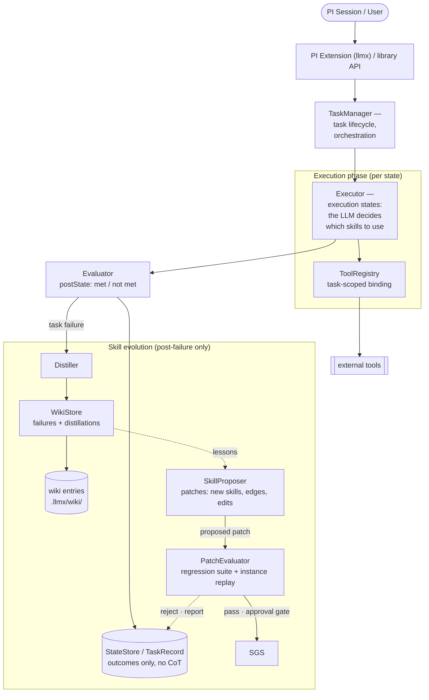

# LLMx — High-Level Design (HLD)

**Status:** Draft v1.1
---
## 1. Overview

### 1.1 Problem

LLM agent contexts grow unboundedly and get poisoned by irrelevant skills, tools, and stale reasoning. Loading every skill/tool into every session degrades performance, and current skill systems are descriptive rather than procedural — there is no way to execute a skill as a defined sequence of state transitions.

### 1.2 Goals

- **Task-scoped context:** each task instance receives only the skills and tools relevant to it.
- **Procedural skills:** skills form a state-transition graph (`preState` → `postState`); Although it's not a hard constraint currently and is open problem to solve. (TODO). Our solution aims to guide the LLM towards a proper state transition. Currently the decision is to not let the executor know about the failure but it's going to be another output to the parent, with a proper error message.
- **Context hygiene:** Chain-of-thought (CoT) lives inside a single task instance and is discarded afterward. Only distilled state, outcomes, and failure lessons shared between tasks(parent -> child).
- **Skill evolution:** failures & success are distilled into an experience wiki; the SkillProposer turns them into skill patches (new skills, edges, edits) so the library improves for future tasks.

### 1.3 Non-Goals
- Multi-agent orchestration / swarm delegation. (Future scope)
---

## 2. System Architecture



## 3. Components

### Interfaces

```ts
// The execution

// TaskManager — one instance per Goal (the top-level entry point).
// It owns the whole lifecycle: create → retrieve → run → teardown.
//
// Responsibilities:
// - owns the Task and its goal-scoped execution state (live preState facts,
//   append-only history, budget/depth guards, checkpoints)
// - creates EVERY executor — TaskExecutor doesn't create sub-executors;
//   an executor asks for a task execution, the manager creates the child
//   executor and relays the child's last message back to the parent
// - teardown: persist TaskRecord (no CoT), discard CoT
//
// Per-Goal state lives on `this` (no locks); expensive stateless services
// (retriever, stores) are process-wide singletons, injected. LLM access goes
// through pi (@earendil-works/pi-coding-agent) — the shared AgentSession the
// manager starts per task owns the model loop, retries, streaming, and tool
// dispatch; there is no separate gateway component.
class TaskManager {
    constructor() {}

    // the top-level entry point — one call per Goal
    async execute(goal: string, initialState: Record<string, unknown> | null = null): Promise<TaskResult> {}

    // called by an executor when the LLM invokes a skill — the manager
    // creates the child executor (relaying is the manager's job, not the parent's)
    spawn(taskOrSkill: Task | Skill, parent: TaskExecutor | null): TaskExecutor {}

    // relays the child's very last message back to the parent's transcript
    relayResult(child: TaskExecutor, parent: TaskExecutor): void {}

    private create(goal: string, initialState: Record<string, unknown> | null): Task {}
    private teardown(task: Task, outcome: Outcome): TaskResult {} // checkpoints every state en route
}

enum ContextPolicy {
    Last,
    All,
    Custom
}

interface SkillContext {
    ....
    contextPolicy: ContextPolicy
}


interface Task {
    id: string, // UUID

}

class TaskExecutor {
    // NOTE: constructor is called only by TaskManager — executors never
    // create sub-executors themselves; they ask the manager (spawn) instead
    constructor(context: SkillContext, manager: TaskManager) {}

    function run(): TaskResult {} // returns as per the context policy
}

interface TaskResult {
    messages: [SessionMessage] // the child executor's final pi AgentSession transcript
}

// The Evolution

```
