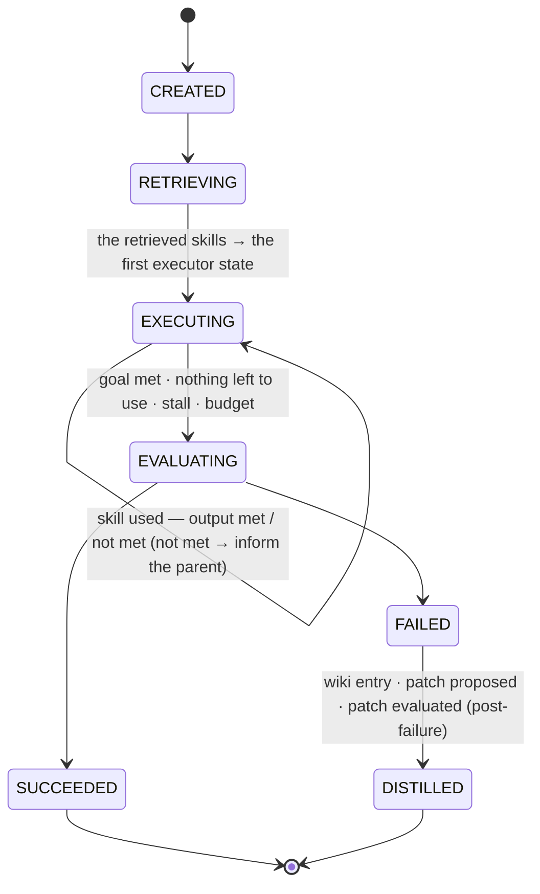
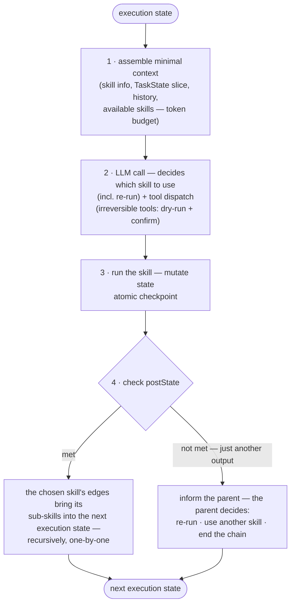

# LLMx — Low-Level Design (LLD)

**Status:** Draft v1.1
**Depends on:** [HLD.md](./HLD.md)

---

## 1. Package Layout

```
src/llmx/
  __init__.py            # public API: LLMx().run(goal), .resume(task_id)
  cli.py                 # typer CLI (see §7)
  task/
    manager.py           # TaskManager, TaskInstance
    state.py             # TaskState {instance, history, skill, tools}, predicate compilation
    record.py            # TaskRecord persistence
    checkpoint.py        # atomic per-state checkpoints
  graph/
    skill.py             # Skill, SkillEdge (pydantic models)
    store.py             # SkillGraphStore (fs load/save; loads a chosen skill's edges)
    validate.py          # schema + graph integrity checks
  retrieval/
    retriever.py         # SkillRetriever (hybrid fusion, top-k, §6)
    indexer.py           # RetrievalIndex (sqlite-vec + FTS5, content-hash incremental)
  propose/
    proposer.py          # SkillProposer (post-failure patch synthesis — skill evolution)
    patch_eval.py        # PatchEvaluator (regression suite + instance replay pipeline, §12)
  exec/
    executor.py          # Executor (execution states, ADR-0004)
    context.py           # ContextAssembler (priority budgeting, §5)
    tools.py             # ToolRegistry, ToolSpec, binding
  eval/
    evaluator.py         # postState checks + task verdict
    checks.py            # state predicate checks
  wiki/
    store.py             # WikiStore
    distill.py           # Distiller (failure trace → lesson)
  llm/
    session.ts           # pi-coding-agent AgentSession binding — model loop, retries, streaming
    tokens.py            # token/cost accounting
  telemetry/
    logging.py           # structlog JSON logs
skills/                  # bundled skills: <domain>/<slug>/skill.md
tests/
```

## 2. Core Schemas (pydantic v2)

### 2.1 Skill file — `skills/<domain>/<slug>/skill.md` ([ADR-0002](../adr/0002-skill-representation-filesystem-frontmatter.md))

YAML front matter + Markdown body:

```jsonc
{
  "id": "slug-or-uuid",
  "title": "",
  "description": "",
  "preState":  { "required": { "repo_cloned": true } },   // predicates over TaskState
  "postState": { "sets":     { "tests_passing": true } },  // what a successful output sets
  "tools": ["shell", "file_edit"],
  "testSuite": "tests/skills/<slug>",   // existing suite the PatchEvaluator runs when this skill is patched
  "edges": [
    {
      "id": "e1",
      "target": "run_tests",
      "forwardDescription": "",   // added to context when the sub-skill enters the state — bridges source → target
      "condition": "tests_passing == true"
    }
  ],
  "metadata": { "created": "", "stats": { "runs": 0, "success_rate": 0.0 } }
}
// body (Markdown) = the procedural instructions the agent executes
```

### 2.2 Runtime types

```python
TaskState      # { instance, history, skill, tools } — carried forward, never
               # reinitialized ([ADR-0004](../adr/0004-taskmanager-recursive-execution.md))
               #   instance { task_id, goal, kv } — preState/postState/edge conditions
               #     compile to predicate lambdas over instance.kv
               #   history — one entry per used skill:
               #     { skill_id, attempt (per-skill, per-task, engine-stamped),
               #       edge_used, post_state_met: bool, state_delta,
               #       result_summary, tool_calls[] }        (never reasoning)
               #   skill — the current skill + position in the chain
               #   tools — the tools bound to the current skill (skill.tools ∩ registry)

TaskRecord     # { id, goal, chain (the chosen skills in order — per-skill
                #   post_state_met + state_delta, from history), component_gaps[],
                #   outcome, final_state, token_usage, duration_ms,
                #   failure_wiki_id?, patch_id? }
                # NO CoT — ever.

WikiEntry      # { id, kind: "failure" | "lesson", task_id,
                #   symptom, cause, lesson, related_skill_ids[], content_hash }

SkillPatch     # { id, origin_task_id, new_skills[], new_edges[],
                #   skill_edits[{ skill_id, fields }], evaluation?, status }
                # status: proposed | evaluated | staged | merged | rejected

PatchReport    # { patch_id, verdict: PASS | REJECT, score,
                #   regression[{ suite, passed, failed }],
                #   instance_replay{ task_id, outcome } }
                # score: PLACEHOLDER mechanism — definition deferred to a future ADR

StepOutput     # { post_state_met: bool, state_delta, tool_calls[],
                #   result_summary, cost }   — an output that doesn't meet the
                #   postState is just another output (HLD §5, decision 9)
Outcome        # SUCCEEDED | FAILED   (task-level only)
```

## 3. Public Interfaces

```python
class LLMx:                                   # src/llmx/__init__.py
    def run(self, goal: str, *, initial_state: dict | None = None) -> TaskResult
    def resume(self, task_id: str) -> TaskResult

class TaskManager:                               # ADR-0004
    def create(self, goal: str, initial_state: dict | None) -> TaskInstance
    def execute(self, task: TaskInstance) -> TaskResult
    # create → retrieve → all the relevant retrieved skills become part of the
    # first executor state (ADR-0001) → drive the execution states → teardown

class SkillRetriever:
    def retrieve(self, query: str, state: TaskState, k: int = 8) -> list[ScoredSkill]
    # the whole retrieved set goes to the top-most executor — nothing pre-built (ADR-0001)

class Executor:                                  # execution states — ADR-0004
    def run(self, state: ExecutionState) -> ExecutionState   # one pass → the next state
    # the LLM decides which skill to use (incl. re-runs); a chosen skill
    # reinitializes the state; its edges bring its sub-skills into the next state
    # the used skill's StepOutput is recorded in history; an output that doesn't
    # meet the postState informs the parent — the parent decides:
    # re-run · another skill · end the chain (HLD §5 #9)

class ContextAssembler:
    def assemble(self, state: ExecutionState, budget: int) -> Prompt
    # current skill body, state slice, history (skill ordering + result
    # summaries), available skills (titles + conditions), tool schemas
    # no wiki input — wiki is consumed by SkillProposer only (HLD §5, decision 7)

class Evaluator:
    def check_post_state(self, skill, state) -> PostStateCheck   # { met: bool, missing: [...] }
    def check_task(self, goal, state) -> Outcome

class SkillProposer:                            # post-failure only — skill evolution
    def propose_patch(self, failure_trace, lessons: list[WikiEntry],
                      related_skills: list[Skill]) -> SkillPatch

class PatchEvaluator:                           # gates every patch before merge (§12)
    def evaluate(self, patch: SkillPatch) -> PatchReport
    # pipeline: (1) regression — test suites of the patched skills
    #            (2) replay — re-run the originating failed instance (sandboxed)
    # scoring mechanism: PLACEHOLDER — to be defined by a future ADR

class WikiStore:
    def lessons_for(self, query, skills) -> list[WikiEntry]
    def record_failure(self, task, trace) -> WikiEntry

class AgentSessionRepository:        # pi-coding-agent (@earendil-works/pi-coding-agent)
    def start(self) -> AgentSession  # createAgentSession() — one session per task, shared across nesting levels
    def prompt(self, text: str) -> PromptResult   # AgentSession.prompt — pi owns the model + tool loop
    def steer(self, text: str)       # deliver while the agent is streaming
    def follow_up(self, text: str)   # queue after the current run finishes
    def subscribe(self, listener)    # session events (turns, tool execution, retries, compaction)
    def dispose(self)

```

## 4. Task Lifecycle State Machine



## 5. Execution Loop (per execution state)



1. **Assemble** — `ContextAssembler.assemble` includes context in priority order until the budget is met; lower priorities are truncated first:
   1. Current skill body (procedure)
   2. Pre/post state slice (only referenced variables)
   3. History — what previous skills produced, the order they were used in (the skill ordering), attempt counts, and result summaries
   4. Available skills — titles + conditions (+ the connecting edge's `forwardDescription`)
   5. Tool schemas — only tools listed in `skill.tools`

   (No wiki content — lessons are consumed only by the SkillProposer after task failure.)
2. **Call** — `AgentSessionRepository.prompt(...)` runs the step through pi: the shared `AgentSession` owns the model request, streaming, and the tool loop. Tools bound to the current skill are registered as session tools and dispatched by pi itself (irreversible tools gated by dry-run + confirm hook inside their implementations). The session's final assistant message is the state's output.
3. **Run & checkpoint** — the chosen skill runs; state changes applied; the execution state written atomically (`checkpoint.py`).
4. **Evaluate** — `Evaluator.check_post_state` runs the `postState` predicates:
   - **met** → the chosen skill's edges bring its sub-skills into the next execution state — recursively, one-by-one;
   - **not met** → **just another output, not a failure**: the skill informs the parent (the state that brought it in; the TaskManager at the top), and the parent decides — re-run the skill, use another skill, or end the chain (HLD §5, decision #9);
   - a skill that brings in no sub-skills is a **dead end, not a failure** — the chain ends there.

   **Safety nets** (no fixed iteration counts, by design): the engine-stamped **attempt count** lets the LLM see a stall forming and change strategy first; the **stall guard** — consecutive attempts of a skill with no state change and the same result end the task — and the **task budget** (`--max-steps`) are the backstops.

**Teardown:** final verdict → persist `TaskRecord` (incl. the chain of chosen skills); success → skill stats updated; failure → `Distiller` writes a `WikiEntry`, then `SkillProposer` proposes a `SkillPatch` (new skills / edges / edits) informed by the trace + lessons — validated, staged, merged behind the optional approval gate (the failing task is not rescued; future tasks benefit); **CoT buffer dropped**.

## 6. Retrieval & Index

- **Hybrid score:** `score = w·semantic + (1-w)·lexical`, `0 ≤ w ≤ 1`
  - `semantic` — cosine similarity between query and skill embeddings (sqlite-vec)
  - `lexical` — BM25 over skill text (title + description + body) via SQLite FTS5
  - Both signals min-max normalized across the candidate set per query before fusion
- **Index:** both signals in `.llmx/index.db` (vec table + FTS5 table); embeddings via a configurable embedding model (independent of the pi agent session).
- **Incremental:** content hash per skill file; `llmx index rebuild` regenerates both tables fully.
- **Degradation:** if one signal is unavailable (e.g., embedding endpoint down), pin `w` to 0 or 1 and fall back to the other.
- **Handoff** ([ADR-0001](../adr/0001-hybrid-retrieval-fusion.md)): the whole retrieved set becomes part of the first executor state — no forward pass, no traversal, no segmentation; sub-skills that were not retrieved arrive during execution via the chosen skill's edges.

## 7. CLI Surface (typer)

```
llmx run "goal" [--state k=v]... [--max-steps N] [--budget tokens]
llmx resume <task_id>
llmx tasks list | show <id>
llmx skills list | show <slug> | graph | add | validate
llmx wiki list | search "<query>"
llmx patches list | show <id> | evaluate <id> | merge <id> | reject <id>
llmx index rebuild
```

## 8. Reliability

- **Session retries:** pi owns automatic retry after transient provider errors (`auto_retry` events, bounded attempts) inside the `AgentSession`; structured JSON outputs where the provider supports them.
- **Checkpoints:** atomic full-state snapshots (the current execution state) → crash-safe `llmx resume` mid-chain.
- **Load-time validation:** skill schema, dangling edges, pre/post predicate compilation errors.
- **Patch safety:** all LLM-proposed patches (new skills / edges / edits) must pass the PatchEvaluator pipeline (§12) + staged dry-run diff before merge; optional human approval.

## 9. Observability

- structlog JSON logs (task_id, step, skill_id on every event)
- Per-task token/cost accounting in `TaskRecord`
- Optional OpenTelemetry spans per step

## 10. Configuration Defaults

| Key | Default | Notes |
|---|---|---|
| `step_context_budget` | 8000 tokens | ContextAssembler target |
| `retrieval_k` | 8 | skills per query — all go to the top-most executor |
| `retrieval_w` | 0.5 | hybrid fusion weight — `score = w·semantic + (1-w)·lexical` |
| `max_chain_depth` | 16 | execution-chain depth bound |
| `max_steps` | unset | task-level step/token budget — the only numeric bound on loops |
| `stall_guard` | on | consecutive attempts with no state change + same result end the task |
| `patch_scoring` | placeholder | scoring mechanism deferred — definition via future ADR |
| `llm.model` / `llm.thinking_level` | pi settings | model selection via pi's `ModelRuntime` (provider catalogs, `auth.json` credentials) |
| `approval_gate` | off | human approval for skill-patch merge |

## 11. Testing Strategy

- **Unit (pure functions):** predicate compilation/evaluation, postState checks, stall-guard detection, execution-state reinitialization + history recording, assembler budgeting, signal normalization + hybrid fusion (including `w` = 0 and `w` = 1 edge cases), patch-pipeline suite selection.
- **Contract:** LLM access contract-tested at the session boundary against a stubbed model (pi provider with scripted responses — the Faux-provider pattern).
- **Integration:** scripted `FakeLLM` drives the full lifecycle, including the failure → wiki → patch → evaluation path, re-run loops, and resume-after-crash.
- **Golden:** prompt-assembly snapshots per state type.

## 12. Patch Evaluation Pipeline

Stage order (per `PatchEvaluator.evaluate`):

1. **Suite selection** — collect the `testSuite`s referenced by every patched skill (edited skills, and targets of new edges); new skills without a suite are flagged as a coverage gap.
2. **Regression run** — execute the selected suites against the patched skill graph.
3. **Instance replay** — re-run the originating failed instance end-to-end in a sandbox with the patched skills; replay writes no wiki entries or patch records (its TaskRecord is flagged `replay`).
4. **Score** — `score(patch, regression_results, replay_outcome)`; the mechanism is a **placeholder** — to be defined by a dedicated ADR (tracked decision).
5. **Verdict** — `PASS` → patch staged behind the approval gate, then merged; `REJECT` → report retained in `.llmx/patches/`, graph unchanged.

Reports live in `.llmx/patches/` alongside the patch; `llmx patches evaluate <id>` re-runs the pipeline on demand.

## 13. Future Extensions

- Patch scoring mechanism (ADR pending — see §12)
- Skill versioning & A/B of alternative chains
- Wiki deduplication/merging of near-identical lessons
- Parallel execution of independent skills
- Export/import of skill packs (git submodules / registries)
