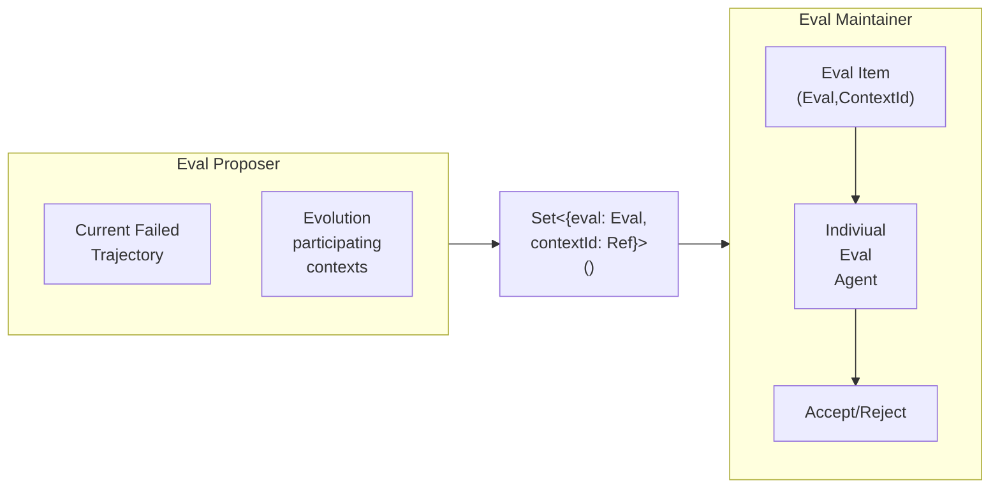
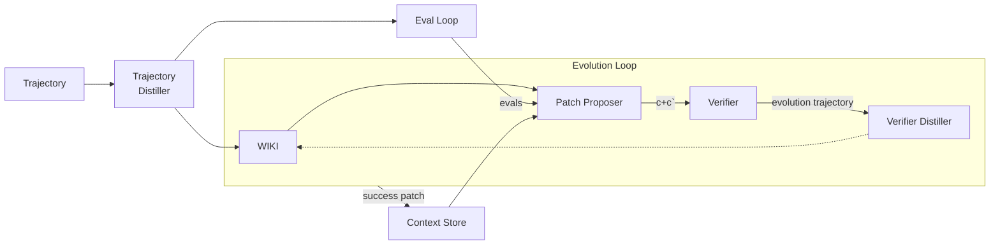

# Architecture

For a evoution to happen we need the following info as input
- The raw trajectory
- Explicit list of context which can participate in the evolution

During the evolution we get the below items as output
- For every failure trajctory we get set of evals to perform on some of the participating context. i.e  `Set<{eval: Eval, contextId: Ref}>()`
- After the evals are set, the evolution loop proposes patches for those contexts with accordance to a verifier.

## Detailed descriptions

### Evals
- Evals are also persisted after a failure trajectory. 
- The eval creator takes into account of the previously available evals. If this is already coveed then it doesn't create more evals.
- For a newer test instance, it defines the eval and the required environment.

We mainly need 2(Agentic) + 1 (Orchestrator) components.

### Evolve
- Evolution happens only the participating `Contexts`.
- This loop proposes new patch to the context & with validation gate it either accepts or rejects the patch and moves ahead.
- The patch is created with the historical trajectory information including previous evolution loop trajectory, and the newer evals.
- The validation happens on top of all the evals, i.e new & old.

- The distillers create more structured output from the trajectory.
- Wiki maintains patterns, lessons, any naural language structure to help proposer better. It maintains a persistent histrory across multiple flow.