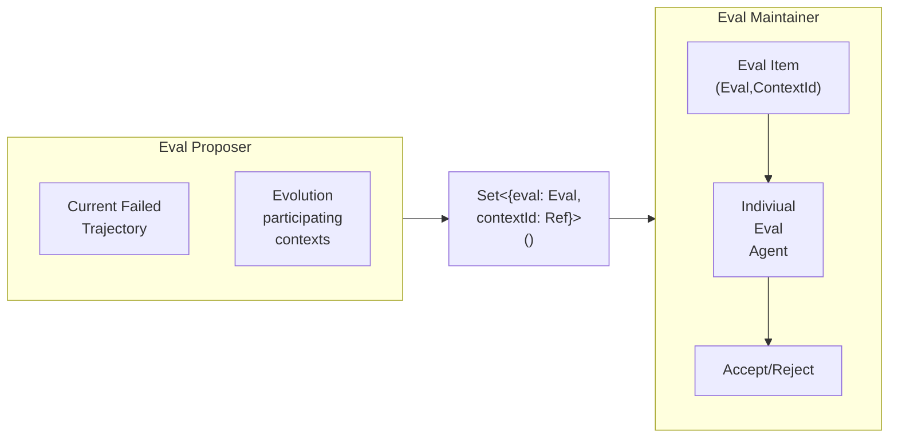

## Notes
- Patch proposer wrong. It should define thw whole patch in single bundle and the validation will happen on the whole patch not individual failures.
- Whole wiki is provided. Not just failures to the proposer.

# Architecture

For a evoution to happen we need the following info as input
- The raw trajectory
- Explicit list of context which can participate in the evolution

During the evolution we get the below items as output
- For every failure trajctory we get set of evals to perform on some of the participating context. i.e  `Set<{eval: Eval, contextId: Ref}>()`
- After the evals are set, the evolution loop proposes patches for those contexts with accordance to a verifier.

## Detailed descriptions

### Evals
- Evals are also persisted after a failure trajectory. 
- The eval creator takes into account of the previously available evals. If this is already coveed then it doesn't create more evals.
- For a newer test instance, it defines the eval and the required environment.

We mainly need 2(Agentic) + 1 (Orchestrator) components.

### Evolve
- Evolution happens only the participating `Contexts`.
- 