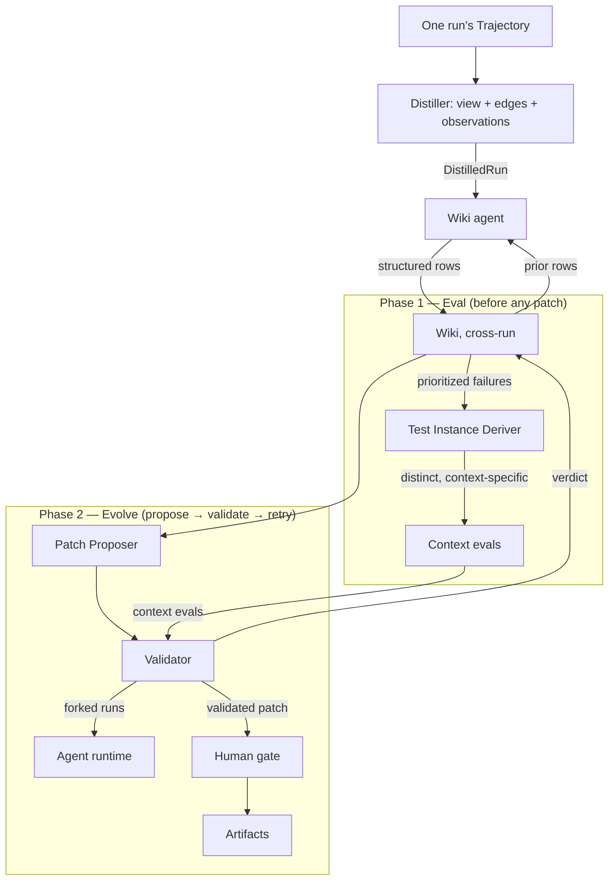
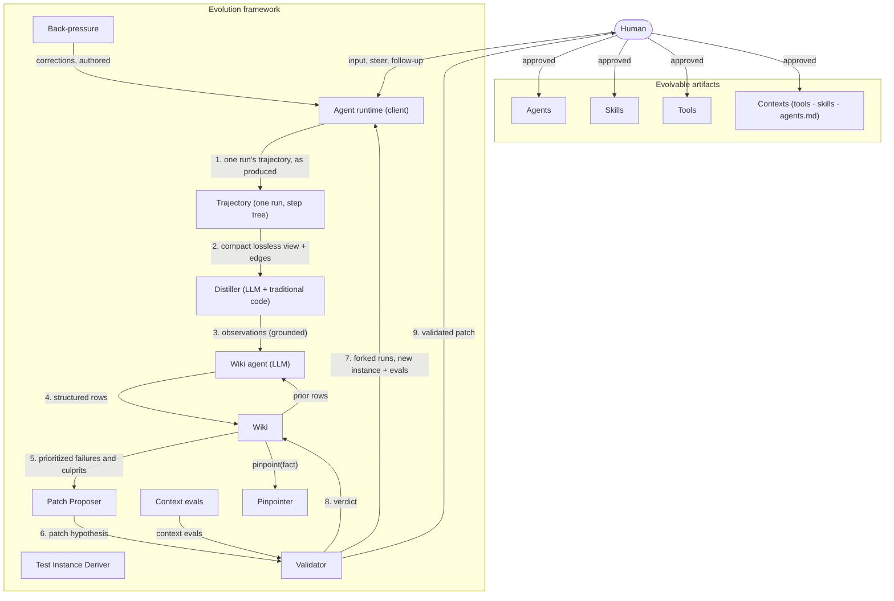
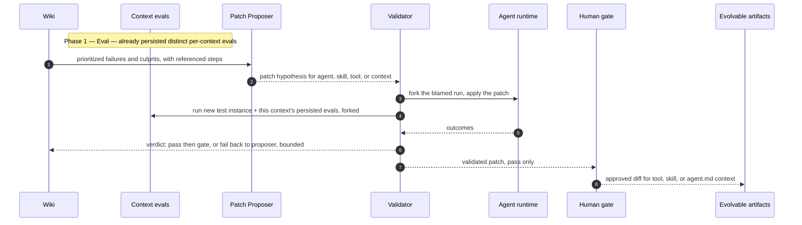

# Evolution Framework — HLD (minimal) & LLD

*Independent of any runtime, storage backend, language, or existing codebase.*

---

# Part I — HLD (minimal)

**Purpose:** a recorded agent run that self-improves by distilling, wikifying,
blaming, and patching.

**Components** (one line each):

| Component | One-liner |
|---|---|
| Agent | runnable — executes a task with its own instructions + tools |
| Skill | non-runnable context attached to an agent's prompt |
| Trajectory | one run's step tree — what the client's executor produced, handed over as-is |
| Distiller | LLM + traditional code — reduces the trajectory to a compact, lossless view with explicit edges, observes it |
| Wiki agent | LLM — turns distilled responses (+ prior rows) into structured rows: patterns, lessons, failure reasons |
| Wiki | curated, time-framed, bounded memory of rows, persisted across runs |
| Pinpointer | deterministic blame — a pure function of the trajectory + context graph |
| Back-pressure | ancestor → descendant failure feedback |
| Test Instance Deriver | derives distinct, context-specific evals from the failing input — before evolution |
| Eval store | per-context persisted evals (dedup'd); the Validator runs them |
| Patch Proposer | proposes patches for any producer |
| Validator | validates patches on a new test instance + the context's evals |
| Human gate | approves validated patches |

**Communication** (the loop):



Full component detail (distiller, wiki agent, back-pressure, artifacts, human
input) is LLD §0.

---

# Part II — LLD

## 0. Component & communication detail (expanded from HLD)



## 1. Data model

```mermaid
classDiagram
    direction LR

    class Trajectory {
        <<one run — the node unit of the step tree>>
        +agentId Ref
        +task string
        +depth number
        +context RunContext
        +steps TrajectoryStep[]
    }

    class TrajectoryStep {
        <<lossless ordered step view>>
        role user/system · content
        type text/thinking · text
        type toolCall · name, arguments, result, isError
        child Trajectory (spawned run)
    }

    class RunView {
        <<the distiller's compact, lossless projection>>
        +runId Ref
        +contexts RenderedContext[]
        +steps ViewStep[]
        +edges ViewEdge[] (spawned, used)
    }

    class WikiRow {
        <<curated sample, never a trajectory copy>>
        +runId Ref
        +kind strategy/pattern/failure/lesson/human_response/back_pressure/patch_hypothesis
        +polarity positive/negative
        +author human/agent
        +refs blamedRef/correctionRef/stepRef
        +culprit role, kind, ref
        +content string
        +patch ContextPatch
        +useCount number
        +lastUsedAt number
        +createdAt number
    }

    class Blame {
        +culprit Ref (the introducing run)
        +role introducer/propagator/missed_detector
        +introducedBy stepRef, kind, contextId
        +propagators Ref[]
        +ancestors Ref[]
        +missedDetectors Ref[]
        +dependents Ref[]
    }

    class ContextPatch {
        +contextId string
        +contextKind tool/skill/agent
        +patch string
        +affected Ref[]
    }

    class Verdict {
        +patch ContextPatch
        +pass boolean
        +evidenceRefs Ref[]
        +reason string
    }

    class ContextEval {
        <<per-context test instance>>
        +id Ref
        +contextId Ref
        +input string
        +expected string
        +source failure/human/seed
        +createdAt number
    }

    Trajectory --> TrajectoryStep : contains (children nest under spawn steps)
    RunView --> Trajectory : projects (losslessly)
    WikiRow --> RunView : references (runId, stepRef)
    WikiRow --> Blame : materializes
    ContextPatch --> WikiRow : proposed from
    Verdict --> ContextPatch : judges
    Verdict --> ContextEval : validated against
```



Key relations:

- A `Trajectory` is **from a single run**; the wiki maintains knowledge
  across runs. Ownership is the nesting (a spawned run under its spawn
  step); step refs (`toolCall` id, else `agentId:position`) are the stable
  handles every edge and row hangs off.
- A `RunView` is smaller than the trajectory but **loses nothing** — every
  step kept, rendered contexts (instructions + offered tools) included, the
  implicit relations (`spawned`, `used`) made explicit as edges.
- A `WikiRow` **references** the run (`runId`, optional `stepRef`); it never
  embeds the trajectory. `culprit.kind` is the context kind to patch:
  `tool` / `skill` / `agent`.
- `useCount`, `lastUsedAt` drive retention (§5).

## 2. Ports

| Port | Owner | Operations | Direction |
|---|---|---|---|
| `ContextStore` | client | `list()`, `get(id)`, `write(context)` | definitions: read; approved patches: write |
| `ModelCall` | client | `complete(prompt)` | raw seam — the framework owns every prompt |
| `Judger` | distiller (LLM half) | `distill(RunView)` → `DistilledEntry[]` | view → observations |
| `TrajectoryDistiller` | distiller | `distill(Trajectory)` → `DistilledRun` | trajectory → view + observations |
| `WikiAgent` | wiki agent | `distill(responses, priorRows)` → `WikiRow[]` | responses + prior rows → rows |
| `WikiPort` | wiki | `record(row)`, `pinpoint(fact)`, `prioritizedFailures()` | wiki agent → wiki, wiki → Patch Proposer |
| `TestInstanceDeriver` | eval deriver | `derive(failingTrajectory, relevantContexts)` → `ContextEval[]` | failures → evals (before the loop) |
| `ContextEvalStore` | eval store | `evalsFor(contextId)`, `worthAdding(contextId, candidate)`, `persist(eval)` | deriver → store, store → Validator |
| `Proposer` | patch proposer | reads `WikiPort`, emits `ContextPatch` | wiki → proposer → validator |
| `Validator` | validator | consumes `ContextPatch`, runs forked tasks, emits `Verdict` | proposer → validator → wiki + gate |
| `RunRunner` | client | `run(original, patched, patch)` → `RunOutcome` | validator → harness (forked, never live) |

Rules of the conversation:

1. **The trajectory is the client's value, read-only** — evolution derives
   everything from it; nothing appends to it.
2. **The wiki never stores the trajectory** — only rows referencing it.
3. **Back-pressure and human responses are rows too**, with an explicit
   `author` (human vs. the agent run), so blame can tell a correction from
   an original input.
4. **A patch is never applied in place**; it is validated on a *forked* run
   first, and the original trajectory is left intact for comparison.
5. **Eval before evolve** — a failing input first derives **distinct**,
   **context-specific** evals (persisted only when novel); the evolution loop
   then runs against them, so a patch must not regress prior instances.

## 3. Runtime flow — wrong output, back-pressure, pinpoint

```mermaid
sequenceDiagram
    autonumber
    participant P as Parent agent
    participant R as Agent runtime
    participant E as Evolution (this run)
    participant W as Wiki

    P->>R: spawn agent B with a task
    Note over R: child runs; its whole run nests under the spawn step
    R-->>P: child output + the run's Trajectory
    Note over P: parent judges the output wrong
    P->>R: back-pressure child, blamed output, correction
    R->>W: record back_pressure row with blamed and correction refs
    R-->>P: corrected output
    Note over E: one instance per finished run, sharing the wiki
    E->>E: distill: trajectory → view → observations
    E->>W: wiki agent: response + prior rows → structured rows
    Note over E: pinpoint (deterministic): first step carrying the fact →
    culprit context, propagators, ancestors, missed detectors
```

## 4. Evolution loop — two phases: Eval, then Evolve

A failing row drives two phases, in order:

1. **Eval (first).** The `Test Instance Deriver` derives candidate test
   instances from the failing input, scoped to the relevant contexts (culprit +
   dependents). A candidate is persisted only if it is **distinct** from that
   context's existing evals — `worthAdding` dedups by input — so each context
   ends with its own eval set. Nothing is proposed yet.
2. **Evolve.** The loop below proposes, validates, and gates. Validation runs
   the new test instance **and** the context's persisted evals on forked
   branches, so a patch must fix the current failure without regressing prior
   ones.



## 5. Retention — the wiki stays small, the trajectory stays with the run

The wiki's purpose is **context**, not archive, so it is bounded:

- **Synthesizing, not copying** — the wiki agent generalizes across runs and
  stores only what matters: strategies that worked, strategies that failed,
  patterns that recur, failure reasons that persist.
- **Eviction is a cache policy** — rows that are old **and** infrequently used
  (`lastUsedAt` + `useCount`) are evicted; reads are capped at top-k by
  recency × frequency × blame convergence, so the Patch Proposer's input stays
  small. (Nothing renders into the executor.)

**Ablation study (planned):** whether wiki lessons should *also* plug into the
executor is deferred to an ablation experiment; today the wiki feeds only the
Patch Proposer.
- **Eviction never deletes evidence** — the run's trajectory is the client's
  immutable record; a distilled-then-evicted judgment is re-derivable by
  re-distilling the same trajectory.
