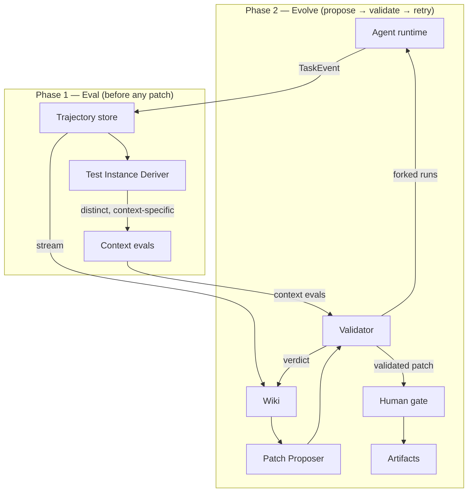
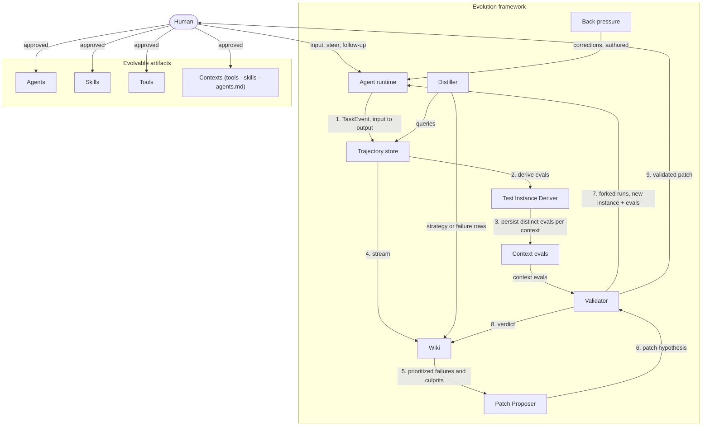
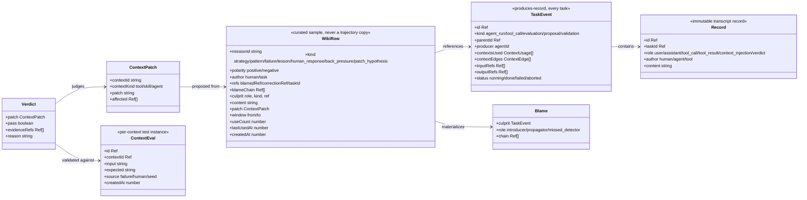
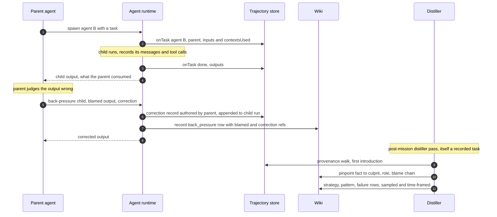
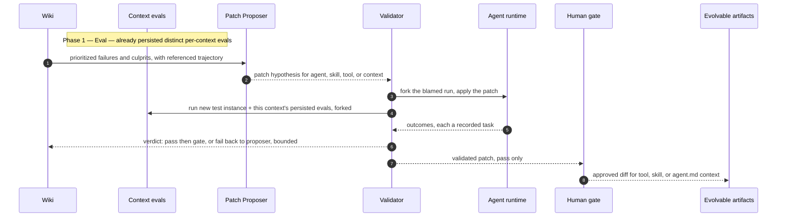

# Evolution Framework — HLD (minimal) & LLD

*Independent of any runtime, storage backend, language, or existing codebase.*

---

# Part I — HLD (minimal)

**Purpose:** a tree of agent tasks that self-improves by recording, distilling,
blaming, and patching.

**Components** (one line each):

| Component | One-liner |
|---|---|
| Agent | runnable — executes a task with its own instructions + tools |
| Skill | non-runnable context attached to an agent's prompt |
| Trajectory store | immutable record of every task's input → output |
| Wiki | curated, time-framed, bounded memory of distilled judgments |
| Distiller | samples the trajectory, pinpoints culprits |
| Back-pressure | ancestor → descendant failure feedback |
| Test Instance Deriver | derives distinct, context-specific evals from the failing input — before evolution |
| Eval store | per-context persisted evals (dedup'd); the Validator runs them |
| Patch Proposer | proposes patches for any producer |
| Validator | validates patches on a new test instance + the context's evals |
| Human gate | approves validated patches |

**Communication** (the loop):

Full component detail (distiller, back-pressure, artifacts, human input) is LLD §0.

---

# Part II — LLD

## 0. Component & communication detail (expanded from HLD)

## 1. Data model

Key relations:

- A `TaskEvent` references its **inputs and outputs** — the provenance edge.
  `parentId` is the ownership edge. These two edges are all blame needs.
- A `WikiRow` **references** trajectory refs; it never embeds the trajectory.
  `culprit.kind` is the context kind to patch: `tool` / `skill` / `agent` (all
  context — lessons never reach the executor).
- `window`, `useCount`, `lastUsedAt` drive retention (§4).

## 2. Ports

| Port | Owner | Operations | Direction |
|---|---|---|---|
| `TaskObserver` | trajectory store | `onTask(TaskEvent)` | runtime → store (the only write) |
| `TrajectoryQuery` | trajectory store | `inputs(ref)`, `children(taskId)`, `ancestors(ref)`, `firstIntroduction(fact)` | store → readers |
| `WikiPort` | wiki | `record(row)`, `pinpoint(fact)`, `prioritizedFailures()` | distiller → wiki, wiki → Patch Proposer |
| `Distiller` | distiller | reads `TrajectoryQuery`, writes `WikiPort` | — |
| `TestInstanceDeriver` | eval deriver | `derive(failingTrajectory, relevantContexts)` → `ContextEval[]` | trajectory → evals (before the loop) |
| `ContextEvalStore` | eval store | `evalsFor(contextId)`, `worthAdding(contextId, candidate)`, `persist(eval)` | deriver → store, store → Validator |
| `Proposer` | patch proposer | reads `WikiPort`, emits `ContextPatch` | wiki → proposer → validator |
| `Validator` | validator | consumes `ContextPatch`, runs forked tasks, emits `Verdict` | proposer → validator → wiki + gate |

Rules of the conversation:

1. **The trajectory is written only through the trajectory store** —
   `onTask` (tasks) and `record` (transcript records). Nothing else appends.
2. **The wiki never stores the trajectory** — only rows referencing it.
3. **Back-pressure and human responses are records too**, with an explicit
   `author` (human vs. ancestor), so blame can tell a correction from an
   original task input.
4. **A patch is never applied in place**; it is validated on a *forked* run
   first, and the original trajectory is left intact for comparison.
5. **Eval before evolve** — a failing input first derives **distinct**,
   **context-specific** evals (persisted only when novel); the evolution loop
   then runs against them, so a patch must not regress prior instances.

## 3. Runtime flow — wrong output, back-pressure, pinpoint

## 4. Evolution loop — two phases: Eval, then Evolve

A failing trajectory drives two phases, in order:

1. **Eval (first).** The `Test Instance Deriver` derives candidate test
   instances from the failing input, scoped to the relevant contexts (culprit +
   dependents). A candidate is persisted only if it is **distinct** from that
   context's existing evals — `worthAdding` dedups by input + coverage/novelty —
   so each context ends with its own eval set. Nothing is proposed yet.
2. **Evolve.** The loop below proposes, validates, and gates. Validation runs
   the new test instance **and** the context's persisted evals on forked
   branches, so a patch must fix the current failure without regressing prior
   ones.

## 5. Retention — the wiki stays small, the trajectory stays forever

The wiki's purpose is **context**, not archive, so it is bounded:

- **Sampling, not copying** — the distiller samples positive and negative runs
  and stores only what matters: strategies that worked, strategies that failed,
  patterns that recur.
- **Time-framing** — a row carries the `window` of trajectory it was sampled
  from, so staleness is measurable: an old-generation strategy is *dated*, not
  merely old.
- **Eviction is a cache policy** — rows that are old **and** infrequently used
  (`lastUsedAt` + `useCount`) are evicted; reads are capped at top-k by
  recency × frequency × blame convergence, so the Patch Proposer's input stays
  small. (Nothing renders into the executor.)

**Ablation study (planned):** whether wiki lessons should *also* plug into the
executor is deferred to an ablation experiment; today the wiki feeds only the
Patch Proposer.
- **Eviction never deletes evidence** — the trajectory stays immutable and
  pinpointable; a distilled-then-evicted judgment is re-derivable by re-running
  the distiller over the still-stored trajectory.
