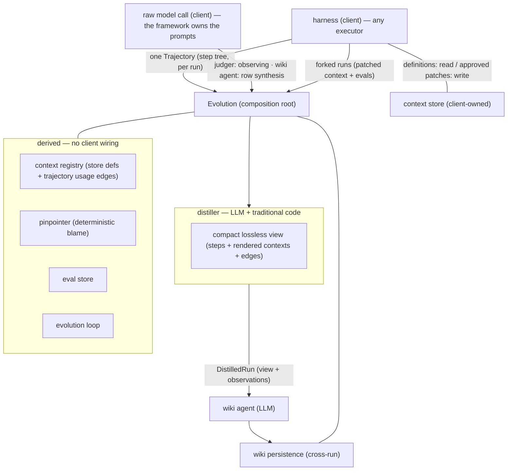
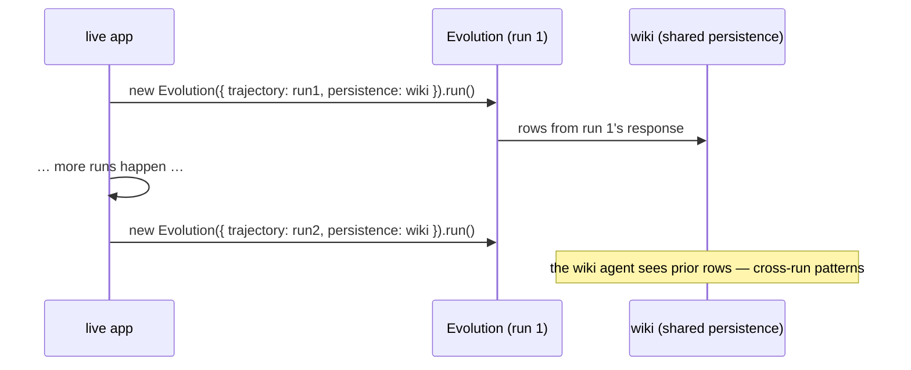
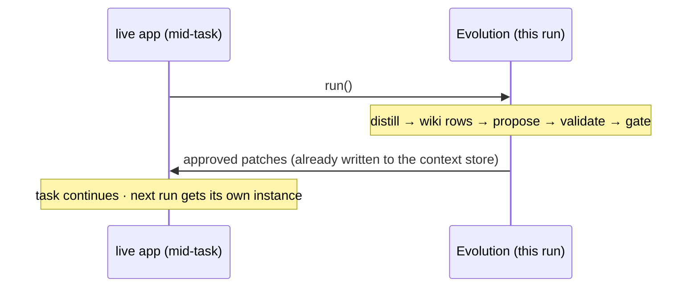

# Wiring Evolution to a Harness

The integration philosophy, in one breath:

> **The client provides one recorded run — its trajectory (the step tree,
> whatever shape its executor produced), the context store (definitions, read
> & write), and a raw model call. Evolution distills the trajectory (an LLM
> plus traditional code) into a smaller lossless view with explicit edges,
> the wiki agent (another LLM) turns every response into structured rows,
> and the wiki — persisted across runs — accumulates the knowledge.**
> Integration surface = one module addition (the context store + the raw
> model/harness seams) and one instance creation per run. Nothing more.

`@llmx/evolution` is ports-only internally, but since the composition root
(`Evolution`) ships in the package, a client never touches the wiring graph —
no registry, wiki, pinpointer, distiller, wiki agent, or loop construction.



## Two lifecycles, one wiki

A `Trajectory` is **from a single run**; the **wiki** maintains knowledge
across many runs through its persistence backend. The same `Evolution`
instance supports two operations: `maintain()` (idempotent — distills the
run into the wiki once) and `run()` (re-entrant full pass — eval → evolve →
gate). `run()` calls `maintain()` first, so calling it alone is always
correct.

**Scenario 1 — offline evolution.** Create one instance per finished run,
sharing one durable wiki:



**Scenario 2 — realtime evolution, then continue the task.** Evolution runs
mid-task, writes the approved patches to the context store itself, and the
task continues rendering from the same store; the next run's instance picks
up from the accumulated wiki:



What makes both work:

- `maintain()` distills the run **exactly once** per instance — a second call
  is a no-op.
- The wiki agent receives the response **plus the wiki's prior rows**, so it
  searches across runs for patterns, lessons, and failure reasons instead of
  relaying one run's observations.
- The context registry re-derives from the context store (definitions —
  patches evolution wrote are immediately current) plus the trajectory's
  usage edges (each agent run → every tool it was offered).
- `run()` is **re-entrant without churn** within an instance: a culprit
  already proposed in an earlier pass (its retry budget spent) is never
  re-proposed by the same instance.

> ponytail: the distilled flag and proposed-culprit set are per-instance. A
> new instance re-proposes a culprit whose failure still sits in the wiki;
> persist the proposed set alongside the wiki when that cost matters.

## The client contract — three things, total

### 1. Provide one run's trajectory (usage) + own the context store (definitions)

- **The trajectory** answers *what happened in this run* — one `Trajectory`
  value: the agent's run as a step tree (user/system messages, assistant
  text and thinking, tool calls with their results, spawned agents nested
  under their spawn step). It is declared structurally in
  `@llmx/evolution` (`trajectory.ts`) so whatever your executor produced
  satisfies it — **no executor import in either direction**.
- **The context store** answers *what the contexts are* — the authoritative
  artifacts (agents, skills, tool docs), addressed by reference, in **read &
  write** mode. It's a three-method port the client implements over whatever
  it already uses — files on disk, a database, or the executor's own stores:

```ts
import type { ContextStore, Trajectory } from '@llmx/evolution';

/** File-backed example: agent YAML bodies + SKILL.md files. */
export class FileContextStore implements ContextStore {
  list() { /* read every artifact, map to Context { id, kind, content, dependsOn } */ }
  get(id) { /* one artifact by reference */ }
  write(context) { /* persist the patched form — the ONLY write path */ }
}

// One recorded run, handed over as-is — your executor's trajectory value
// satisfies the shape structurally (agentId, task, depth, context, steps).
const trajectory: Trajectory = missionResult.trajectory;
```

`write` is reserved for applying gate-approved patches — evolution never
writes anything else, and never invents contexts. Definitions come from the
store; usage (which agent rendered which tool, when) comes from the
trajectory; the registry merges the two, and a context the store does not
own is never a patch target.

One id convention makes derivation work: a tool's context id is
`tool:<name>` (the trajectory model derives it), and an agent's context id
is its `agentId` — both must match the context store's references for a
culprit to be patchable.

### 2. One module addition — the context store + the raw seams

The only things evolution cannot provide for itself are your artifacts (the
`ContextStore` above) and two raw seams. Write them once, in one adapter
module — **no prompts**: the framework owns every prompt (observing, the wiki
agent's row synthesis, judging):

```ts
import type { ModelCall, RunRunner } from '@llmx/evolution';

/** Raw model seam: prompt in, completion out. Which model, which transport,
 * what it costs — yours. What the prompt says — the framework's. */
export const model: ModelCall = {
  complete: async (prompt) => yourLlm.complete(prompt),
};

/** Harness seam: one forked validation run — patched context + evals,
 * never live. */
export const runner: RunRunner = {
  run: (original, patched, patch) => {
    // Run your harness with `patched` rendered instead of `original`,
    // replay the evals for patch.contextId as stimulus, and report pass.
    return { pass: true, evidenceRefs: [] };
  },
};
```

The prompts themselves are maintained by the framework:

- **The distiller** (`DefaultTrajectoryDistiller`) is an LLM plus traditional
  code: the traditional half projects the trajectory into a compact,
  **lossless** view (every step kept, rendered contexts, and the implicit
  relations made explicit as edges — `spawned` ownership edges, `used`
  context-usage edges); the LLM half (`PromptedJudger`) observes that view and
  returns grounded observations under a strict JSON protocol (culprit refs
  must be rendered contexts; malformed output throws rather than silently
  judging).
- **The wiki agent** (`PromptedWikiAgent`) takes the responses plus the
  wiki's prior rows and produces structured rows — generalizing across runs
  into patterns, lessons, and failure reasons rather than relaying
  observations verbatim. Same validation rules; row ids are deterministic
  (`runId:index`).

`Judger` and `WikiAgent` overrides exist for tests or fully custom
protocols — the normal client never writes them (exactly one of `model` /
both overrides is required at construction).

### 3. Instance creation — then it drives itself

```ts
import {
  Evolution,
  SqliteWikiPersistence,
} from '@llmx/evolution';

const result = await new Evolution({
  trajectory,        // this run's step tree (usage)
  contexts,         // your ContextStore (definitions, read & write)
  model,            // raw model call — the framework writes the prompts
  runner,           // from your adapter module
  decide: (v) => humanReview(v),          // optional — default rejects all
  persistence: new SqliteWikiPersistence( // optional — default in-memory;
    'data/evolution-wiki.sqlite'),        // durable = knowledge across runs
  sourcePaths: ['src', 'packages'],       // optional — see below
}).run();

// result.verdicts   — verdicts proposed *this pass* (after bounded retries)
// result.approved   — patches approved *this pass*; each was already
//                     written to the context store (participation)
// result.retriesUsed
```

`maintain()` keeps the wiki current (call it — awaited — whenever you want
the run distilled without evolving); `run()` performs the whole pass —
`maintain()`, then, in order:

1. **Distill + wikify** — the trajectory becomes the compact lossless view,
   the judger observes it, and the wiki agent turns the response (plus prior
   rows) into structured rows, once.
2. **Eval** — for each prioritized failure: test instances derived for the
   culprit + its dependents, persisted deduplicated.
3. **Evolve** — propose → validate on forked runs (your `RunRunner`) →
   bounded retry (default 3).
4. **Gate** — verdicts become wiki rows; only *passed* verdicts reach your
   `decide`; approved patches are written to the context store.

## What derives vs. what you write

| | Provided by |
|---|---|
| The run's `Trajectory` (step tree) | **you** — any executor's value, structural |
| Context definitions, read & write | **you** — `ContextStore` in the adapter module |
| Raw model call (`ModelCall`), `RunRunner`, gate `decide` | **you** — one adapter module |
| The distiller (view + edges, judging prompt) | evolution — framework-owned |
| The wiki agent (row synthesis prompt) | evolution — framework-owned |
| Context registry, dependency graph, usage edges | evolution — from the trajectory + store |
| Wiki, pinpointing, retention, cross-run persistence | evolution |
| Eval store, test derivation | evolution |
| Proposer, verifier, retry bounding, loop | evolution |
| Patch application | default appends text; override via `applier` |
| Source-code exclusion | you — mention paths via `sourcePaths`; never patched |

Everything except the client seams is a pure function of the two client
inputs: the run's trajectory (usage) and the context store (definitions).

### Source code never participates

Evolution's patch targets are **prompt-layer artifacts only** — tool, skill,
and agent contexts. It never proposes a patch for source code. Mention the
source code paths at instance creation and every context whose id is one of
those paths — or lives under one as a directory — is excluded from every
patching phase: no eval derivation, no proposal, no forked validation, no
gate. Failures blamed on source code still land in the wiki as knowledge
(what the wiki agent records); compensating for them is a wiki-agent judgment
(blame the prompt layer), never a code patch.

## Open seams (by design)

Two seams are deliberately unimplemented and marked `ponytail:` in the
source: the `RunRunner`'s forked-run body (yours — it is your harness), and
the proposer's patch *text* (the default proposes an empty patch; it will be
framework-prompted over the same `ModelCall` when patch content matters).
The distiller's view is untruncated by design (one model call per run);
window or stream it when real runs outgrow a single prompt. Everything else
— the view + edges, pinpointing, wiki retention, eval derivation, verdict
distillation, retry bounding, gating — runs on the provided defaults.

See `docs/architecture/evolution-framework.md` for the design and
`docs/adr/` for the substrate decision.
