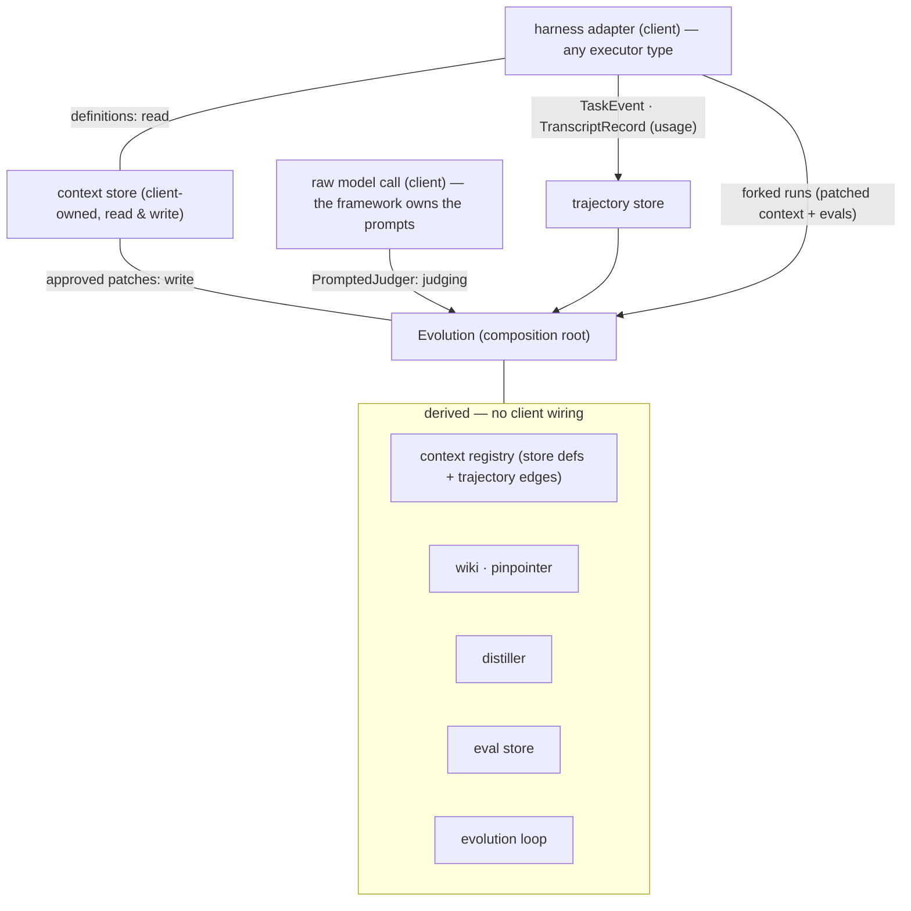
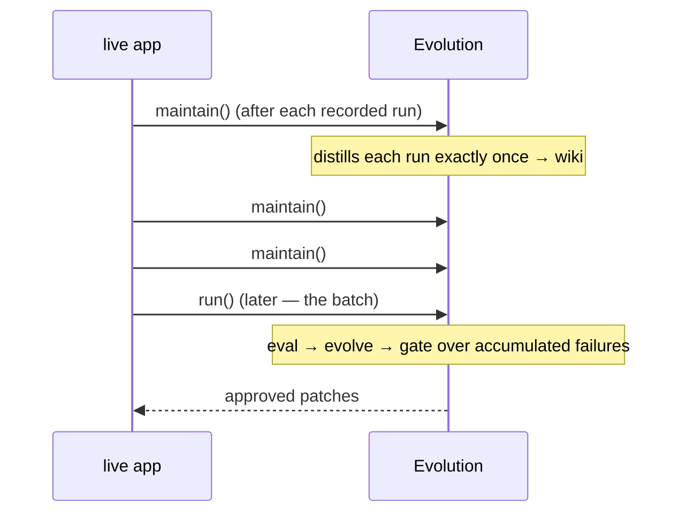
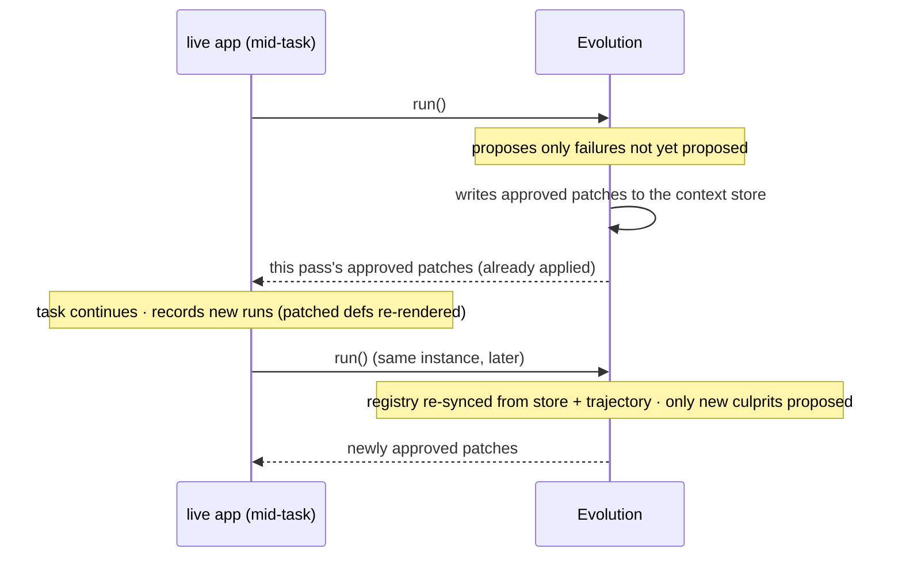

# Wiring Evolution to a Harness

The integration philosophy, in one breath:

> **The client provides the trajectory (usage), the context store
> (definitions, read & write), and a raw model call. Evolution derives what
> was used and when from the trajectory, owns every prompt (including
> judging), wires itself in one place, and drives on its own.**
> Integration surface = one module addition (the context store + the raw
> model/harness seams) and one instance creation. Nothing more.

`@llmx/evolution` is ports-only internally, but since the composition root
(`Evolution`) ships in the package, a client never touches the wiring graph —
no registry, wiki, pinpointer, distiller, or loop construction.



## Two lifecycles, one instance

The same `Evolution` instance supports both scenarios through two
operations: `maintain()` (idempotent, incremental — keeps the wiki current)
and `run()` (re-entrant full pass — evolve + gate). `run()` calls
`maintain()` first, so calling it alone is always correct.

**Scenario 1 — offline evolution.** The live app produces the trajectory and
keeps the wiki maintained; evolution happens later, in one batch:



**Scenario 2 — realtime evolution, then continue the task.** Evolution runs
mid-task and writes the approved patches to the context store itself; the
task continues rendering from the same store — new runs re-sync the derived
context graph and later passes pick up only new failures:



What makes both work:

- `maintain()` judges each run **exactly once** — a run already distilled is
  never re-sent to the `Judger`.
- The context registry **re-syncs on every `maintain()`** — definitions
  re-read from the context store (so patches evolution wrote are
  immediately the current form) plus usage edges from the trajectory; later
  forked validations verify against the *current* form.
- `run()` is **re-entrant without churn**: a culprit already proposed in an
  earlier pass (its retry budget spent) is never re-proposed by the same
  instance.
- `result.approved` is **this pass's** approvals — each already written to
  the context store, so the continuing task renders the patched form.

> ponytail: the distilled-run and proposed-culprit sets are per-instance. A
> long-lived offline instance that must survive restarts re-judges its
> history (wiki rows dedup by id, so correctness holds); persist the sets
> alongside the wiki when that cost matters.

## The client contract — three things, total

### 1. Record a trajectory (usage) + own the context store (definitions)

Two inputs, one responsibility split:

- **The trajectory** answers *what was used, and when* — recorded by your
  harness adapter (any executor type) as `TaskEvent`s and
  `TranscriptRecord`s.
- **The context store** answers *what the contexts are* — the authoritative
  artifacts (agents, skills, tool docs), addressed by reference, in **read &
  write** mode. It's a three-method port the client implements over whatever
  it already uses — files on disk, a database, or the executor's own stores:

```ts
import type { ContextStore } from '@llmx/evolution';

/** File-backed example: agent YAML bodies + SKILL.md files. */
export class FileContextStore implements ContextStore {
  list() { /* read every artifact, map to Context { id, kind, content, dependsOn } */ }
  get(id) { /* one artifact by reference */ }
  write(context) { /* persist the patched form — the ONLY write path */ }
}
```

`write` is reserved for applying gate-approved patches — evolution never
writes anything else, and never invents contexts. Definitions come from the
store; usage comes from the trajectory; the registry merges the two (store
definitions + observed usage edges), and a context the store does not own is
never a patch target.

**The trajectory side** — whatever runtime you own, write two kinds of rows
into an `InMemoryTrajectoryStore` (or your own `TrajectoryStore`):

- **One `TaskEvent` per task** via `onTask` — with `contextsUsed` (which
  contexts were rendered, `recordRef` pointing at the rendered record) and
  `contextEdges` (which context used which). `parentId` is ownership
  (spawned → spawner); `inputRefs`/`outputRefs` is provenance.
- **One `TranscriptRecord` per transcript message** via `record` — role
  (`user` / `assistant` / `tool_call` / `tool_result` /
  `context_injection` / `verdict`) and **real content**. Content is what
  fact-matching (`firstIntroduction`) searches, and `context_injection`
  records are where evolution gets each context's content.

Two id conventions make derivation work: context ids carry their kind
prefix (`tool:…`, `skill:…`, anything else is an agent) and match the
context store's references, and context edges run `from → to` = "from
depends on to".

### 2. One module addition — the context store + the raw seams

The only things evolution cannot provide for itself are your artifacts (the
`ContextStore` above) and two raw seams. Write them once, in one adapter
module — **no prompts**: the framework owns every prompt (judging today;
patch proposing is a marked seam):

```ts
import type { ModelCall, RunRunner } from '@llmx/evolution';

/** Raw model seam: prompt in, completion out. Which model, which transport,
 * what it costs — yours. What the prompt says — the framework's. */
export const model: ModelCall = {
  complete: async (prompt) => yourLlm.complete(prompt),
};

/** Harness seam: one forked validation run — patched context + evals,
 * never live. */
export const runner: RunRunner = {
  run: (original, patched, patch) => {
    // Run your harness with `patched` rendered instead of `original`,
    // replay the evals for patch.contextId as stimulus, and report pass.
    return { pass: true, evidenceRefs: [] };
  },
};
```

The judging prompt itself (`PromptedJudger`) is maintained by the framework:
grounded-only rules, the rendered contexts, the transcript, a strict JSON
judgment protocol, and response validation (culprit refs must be rendered
contexts; malformed model output throws rather than silently judging). A
`judger` option still exists as an override for tests or fully custom
judgment protocols — the normal client never writes one.

### 3. Instance creation — then it drives itself

```ts
import {
  Evolution,
  InMemoryTrajectoryStore,
  SqliteWikiPersistence,
} from '@llmx/evolution';

const trajectory = new InMemoryTrajectoryStore();
// …your harness adapter records into it as tasks run…

const result = await new Evolution({
  contexts,           // your ContextStore (definitions, read & write)
  trajectory,         // usage — what was used, when
  model,              // raw model call — the framework writes the prompts
  runner,             // from your adapter module
  decide: (v) => humanReview(v),          // optional — default rejects all
  persistence: new SqliteWikiPersistence( // optional — default in-memory
    'data/evolution-wiki.sqlite'),
  sourcePaths: ['src', 'packages'],       // optional — see below
}).run();

// result.verdicts   — verdicts proposed *this pass* (after bounded retries)
// result.approved   — patches approved *this pass*; each was already
//                     written to the context store (participation)
// result.retriesUsed
```

`maintain()` keeps the wiki current (call it — awaited — as the live app
records); `run()` performs the whole pass — `maintain()`, then, in order:

1. **Derive + distill** — the context registry re-syncs (definitions from
   the context store, usage edges from `contextEdges`; rendered contexts
   the store doesn't own stay graph-visible but unpatchable) and each
   *unseen* top-level run becomes wiki rows via the framework's
   `PromptedJudger` over your `ModelCall`, exactly once.
2. **Eval** — for each prioritized failure: test instances derived for the
   culprit + its dependents, persisted deduplicated.
3. **Evolve** — propose → validate on forked runs (your `RunRunner`) →
   bounded retry (default 3).
4. **Gate** — verdicts become wiki rows; only *passed* verdicts reach your
   `decide`; approved patches are written to the context store.

## What derives vs. what you write

| | Provided by |
|---|---|
| Trajectory data (`TaskEvent`s, records) | **you** — harness adapter (any executor) |
| Context definitions, read & write | **you** — `ContextStore` in the adapter module |
| Raw model call (`ModelCall`), `RunRunner`, gate `decide` | **you** — one adapter module |
| The judging prompt (`PromptedJudger`) | evolution — framework-owned |
| Context registry, dependency graph | evolution — from the trajectory |
| Wiki, pinpointing, retention | evolution |
| Distiller, eval store, test derivation | evolution |
| Proposer, verifier, retry bounding, loop | evolution |
| Patch application | default appends text; override via `applier` |
| Source-code exclusion | you — mention paths via `sourcePaths`; never patched |

Everything except the client seams is a pure function of the two client
inputs: the trajectory (usage) and the context store (definitions).

### Source code never participates

Evolution's patch targets are **prompt-layer artifacts only** — tool, skill,
and agent contexts. It never proposes a patch for source code. Mention the
source code paths at instance creation and every context whose id is one of
those paths — or lives under one as a directory — is excluded from every
patching phase: no eval derivation, no proposal, no forked validation, no
gate. Failures blamed on source code still land in the wiki as knowledge
(what the `Judger` records); compensating for them is a `Judger` judgment
(blame the prompt layer), never a code patch.

## Open seams (by design)

Two seams are deliberately unimplemented and marked `ponytail:` in the
source: the `RunRunner`'s forked-run body (yours — it is your harness), and
the proposer's patch *text* (the default proposes an empty patch; it will be
framework-prompted over the same `ModelCall` when patch content matters).
The judging prompt is **not** an open seam — `PromptedJudger` owns it.
Everything else — trajectory, pinpointing, wiki retention, eval derivation,
verdict distillation, retry bounding, gating — runs on the provided defaults.

See `docs/architecture/evolution-framework.md` for the design and
`docs/adr/` for the substrate decision.
